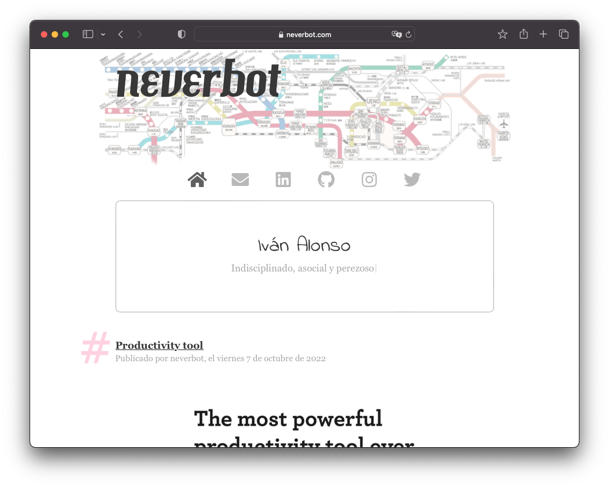

## neverbot.com static page, made by Ivan Alonso ([@neverbot](https://github.com/neverbot))

Based on the [Astral Template by HTML5 UP](http://html5up.net/astral)
(old @n33co, now @ajlkn)
aj@lkn.io | [@ajlkn](https://twitter.com/ajlkn)

### License:

[Creative Commons Attribution 3.0](license.txt)

Except photographs in `images/photos`, which are © [@neverbot](https://github.com/neverbot)

### Other licenses:

 * Icons from [Font Awesome](http://fontawesome.io/) v5.8.1 (Icons: CC BY 4.0, Fonts: SIL OFL 1.1, Code: MIT License)
 * [jQuery](http://jquery.com/) v3.3.1 from jQuery Foundation (MIT License)

### Some places where I took ideas from (take a look too, it's the better way to learn):

 * Portrait effect: [http://codepen.io/maxme/pen/AobLn](http://codepen.io/maxme/pen/AobLn)
 * Image halo effect: [http://jsfiddle.net/zcPVj/22/](http://jsfiddle.net/zcPVj/22/)
 * Typewriter effect: [http://themes.playnethemes.com/mayde/](http://themes.playnethemes.com/mayde/)
