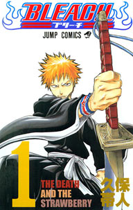

**Bleach** (Tomos 1 a 6) Autor: [Tite Kubo](http://en.wikipedia.org/wiki/Tite_Kubo) Edita: [Glenat España](http://www.edicionesglenat.es/)

**Otros enlaces**: [Bleach Portal](http://www.bleachportal.net/) Bleach en [Shonen Jump](http://www.shonenjump.com/mangatitles/b/manga_b.php) (edición original) [Wikipedia](http://en.wikipedia.org/wiki/Bleach_%28manga%29)

**De qué va esto**: Típico protagonista de [Shonen](http://en.wikipedia.org/wiki/Sh%C5%8Dnen) (Ichigo) de repente se encuentra con una chica rara con poderes. Razones diversas hacen que parte de esos poderes pasen de ella a él, lo que hará que tengan que permanecer juntos durante un tiempo para entender lo que ha pasado y acostumbrarse a la nueva situación.

La chica (Rukia) resulta ser una Shinigami, que viene a ser algo así como un Van Helsing de espíritus malvados, perteneciente a una organización encargada de hacer que estos fantasmas (Hollows) vayan a donde les corresponde sin molestar. Como ha perdido parte de sus habilidades, Ichigo tendrá que ocuparse temporalmente de estos asuntos.

Según avanzan los tomos, los diferentes personajes secundarios van apareciendo, presentándose, desarrollando habilidades de un modo que aún no me han explicado satisfactoriamente... etc, etc. Pero tienen su gracia, dentro de ser clichés sin ningún trasfondo. En los tomos 5 y 6, de hecho, comienzan a aparecer nuevos personajes algo más interesantes y se nos cuenta algo de ese trasfondo hasta ahora oculto, por lo que podría mejorar la historia en los próximos tomos.

El dibujo, aunque a veces parece apresurado, a mí me basta. Las ilustraciones de portadas y portadillas, eso sí, me parecen magistrales, aunque ayuda mucho el hecho de que el autor sea una fiera en lo que a diseño de personajes se refiere. Ya estoy deseando hacerme con una figura de Ichigo en su forma de Shinigami...

Siete euros y medio por tomo... me lo puedo permitir durante unos tomos más, por ahora me está gustando lo suficiente.

**Según un gafapasta**:  Ilegible, como tebeo no vale un pimiento. Guión confuso y que se va creando según al autor se le van ocurriendo cosas. Da la impresión de que no sabe a dónde quiere ir.

Según un friki:  Pues oye, es divertido, los personajes son carismáticos (entendiendo carismáticos como bien diseñados, porque personalidad cero).