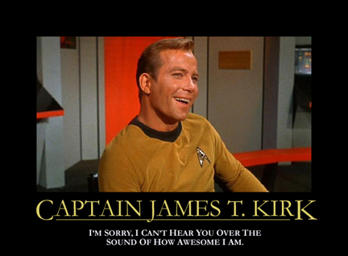

[Posters ficticios](http://echosphere.net/star_trek_insp/star_trek_insp.html) (¡4 páginas!) inspirados en el universo Star Trek, vía [Monkinetic](http://redmonk.net/archives/2006/08/08/star-trek-inspirational-posters/).

Algunos son magistrales, y me están dando ganas de volver al [Star Trek original](http://memory-alpha.org/en/wiki/Star_Trek:_The_Original_Series), que hace mucho que no veo ninguna serie o película que no sea de [La Nueva Generación](http://memory-alpha.org/en/wiki/Star_Trek:_The_Next_Generation).