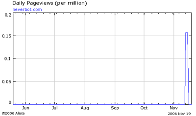

Hoy es uno de esos... cómo decirlo... días de mierda. No me apetece escribir sobre nada, así que os vais a tener que contentar con esto: [Alexa](http://www.alexa.com/) se ha dado cuenta (por fin) de que [existo](http://www.alexa.com/data/details/traffic_details?y=p&url=http%3A%2F%2Fwww.neverbot.com). Existo muy levemente, como si estuviera en un país lejano que a nadie importa, pero existo. Debería echarle un vistazo a ver qué narices significa la gráfica y unos cuantos datos más que pueden verse, pero no tengo ganas.

Me he enterado porque en el [perfil de la página en technorati](http://www.technorati.com/blogs/http%3A%2F%2Fwww.neverbot.com) ya no dice eso de "Not in first x" o algo así, siendo ese x un número ridículamente grande. Es decir, sigo siendo un don nadie absoluto, pero un don nadie con una gráfica.

Y hoy me han regalado una agenda en el trabajo. Con logotipo y todo. Tenemos nuestro propio pan y circo.