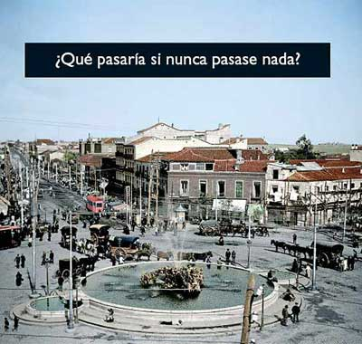

Que el ayuntamiento actual de Madrid financie una campaña publicitaria (autopublicitaria, claro está) con un mensaje progresista sería, como poco, sorprendente. Claro que no se refiere a asuntos sociales o políticos, sino simplemente a urbanísticos/inmobiliarios. Tranquilo, oh pueblo, que las obras que el faraón está llevando a cabo son necesarias.

Estoy harto de Gallardón. Harto de que haya dejado Madrid empantanado económicamente para las próximas décadas (las obras ya las pagarán los proximos gobiernos, que por ahora paga el banco). Harto de tardar hora y media en llegar a trabajar en la misma ciudad en la que vivo. Harto de que los que vienen desde Arganda o Parla tarden menos en llegar que yo. Harto de que me cobren por comprar un coche, por circular, por gastar la vía pública y por aparcar. Harto de que una panda de analfabetos con trajes de "Agente de Movilidad" crean ser capaces de dirigir el tráfico y sólo causan atascos mayores. Harto de que el metro no abra de noche y se pague a empresas de autobuses para que hagan lo que debería hacer el metro. Harto de que cierren líneas de metro durante meses y meses. Harto de que la línea 5 siga siendo la más lenta y la que cuenta con trenes más viejos. Harto de la M30. Harto de que cada día cambie el recorrido, de circular por el cauce de un río, de que la cierren cuando quieran y de que hayan cortado casi todos los accesos y salidas. Harto de que se paguen cientos de millones de euros a una empresa por un peaje fantasma sobre la M45. Harto de las autopistas radiales de peaje que enriquecen a empresas privadas... Harto de estar harto. Dejo de escribir porque me hierve la sangre. Y eso que no he entrado en cuestiones inmobiliarias.

Pues desde luego Madrid seguiría siendo un lugar bonito para vivir.