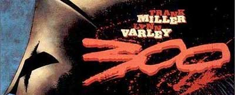

Se me plantea una enorme duda al respecto de la película. Vaya por delante el pensamiento de que para mí [Frank Miller](http://en.wikipedia.org/wiki/Frank_Miller_%28comics%29) es uno de los grandes del cómic. Y cuando digo grandes quiero decir uno de los pilares fundamentales a quien hay que leer antes o después. Creo que [Batman: El regreso del caballero nocturno](http://en.wikipedia.org/wiki/Batman:_The_Dark_Knight_Returns), [Daredevil: Born Again](http://en.wikipedia.org/wiki/Daredevil:_Born_Again) o [Sin City](http://en.wikipedia.org/wiki/Sin_City), por ejemplo, son obras muy grandes. Pero también ha hecho truños como la copa de un pino.

Una de las cosas que me quedaban pendiente por leer de él era [300](http://en.wikipedia.org/wiki/300_%28comics%29) (tampoco he leido [Ronin](http://en.wikipedia.org/wiki/Ronin_%28comic_book_series%29), ni nada de [Martha Washington](http://en.wikipedia.org/wiki/Give_Me_Liberty) por ejemplo). Viendo que la película está en ciernes, he preferido hacerme con el tomo antes para saber a qué atenerme.

Honestamente, es un bluff. Apaisado y muy espectacular, pero se acerca más a un libro de ilustraciones que a un verdadero cómic. La narrativa es prácticamente nula, siendo casi todas las páginas una gran ilustración con algunas pequeñas viñetas alrededor para tener dónde colocar los bocadillos. Se lee en apenas unos minutos, y es que la historia no da para mucho más.

*   Introducción: Pues parece que va a haber guerra, ¿no?
*   Nudo: Pues sí que había guerra, sí. Un montón de cadáveres.
*   Desenlace: Pasa lo que tenía que pasar.

Lo más fácil que se me ocurre para establecer una comparación es el [Shanna: La diablesa](http://en.wikipedia.org/wiki/Shanna_the_She-Devil) de [Frank Cho](http://en.wikipedia.org/wiki/Frank_cho) que se publicó hace poco. Si te gusta el autor merece la pena, pero no esperes que te cuente nada más aparte de lo obvio. Que vale, está bien. No se le puede pedir mucho más a un volumen único con el pequeño número de páginas que tiene. Es un experimento más como otro cualquiera, y viniendo de Frank Miller se le puede echar un vistazo para ver que tal está.

Pero ahora viene mi duda. Se está haciendo una película. Y además una película donde se "experimenta" rodando sin "traducir" de un medio a otro. Cogiendo directamente cada plano del cómic y construyéndolo con actores y una cámara. Tal y como se hizo con [Sin City](http://en.wikipedia.org/wiki/Sin_City_%28film%29). Claro que para Sin City se usaron cuatro historias (creo recordar) de la colección, varios cientos de páginas de tebeo, para construir un argumento completo. El resultado puede ser más o menos del gusto de cada uno, pero al menos había cosas que contar.

En [300](http://en.wikipedia.org/wiki/300_%28film%29) no hay nada que contar que dé para más de media hora. Pero aun así, por las imágenes que he visto en el trailer, parece que quieren seguir respetando el guión exacto del cómic. Es un trailer increíblemente espectacular, eso es cierto, pero de hecho ya te cuenta toda la historia. No entiendo qué se van a inventar para llenar una película completa. O empiezan a inventar historia o va a quedar un truño infumablemente lento y aburrido.