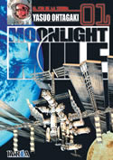

Estaba un poco cansado de leer siempre lo mismo. Que tampoco es que yo lea siempre lo mismo, dado que últimamente intercalo a [Mark Millar](http://en.wikipedia.org/wiki/Mark_Millar) con [Herman Hesse](http://en.wikipedia.org/wiki/Herman_Hesse) con [Philip K. Dick](http://en.wikipedia.org/wiki/Philip_k_dick), pero el caso es que me apetecía leer algo de lo que no supiera nada... Es algo que hago pocas veces, como cuando paseo por la [Casa del Libro](http://www.casadellibro.es/) o por la [Fnac](http://www.fnac.es/) y veo algo que me llama la atención. Quién sabe si por el color de la portada, por el autor o por el tacto del libro. Eso es algo que [amazon](http://www.amazon.com/) no puede tener... claro que amazon tiene millones de cosas que no tiene la fnac y lo ponen en tu casa. But I digress...

Así que me planté delante de la estantería de manga de mi librería especializada favorita (favorita de esa semana, porque cada vez compro en una diferente). Y miré. Vaya cantidad de desgracias todas juntas. Ví un tomo de [Moonlight Mile](http://en.wikipedia.org/wiki/Moonlight_Mile_%28manga%29) y creo que me gustó la portada, cogí el tomo y lo ojeé rápidamente. Quedó guardado en alguna parte de mi cerebro como "algo que quizá algún día me compre si no tengo ninguna otra cosa que leer", que viene a ser lo mismo que decir "las posibilidades son cercanas a cero".

Pero llegó el día en que no tuve nada que comprar (oh, sorpresa, esas cosas a veces ocurren) y me llevé los dos primeros tomos. Ahora mismo llevo leídos cinco, y sigo sin prisa, porque sé que el ritmo de publicación es lento y además queda ya poco para alcanzar a los tomos japoneses (8 en españa, 14 en japón si no me equivoco).

Las primeras páginas del primer tomo son claramente [Hentai](http://en.wikipedia.org/wiki/Hentai), que es algo que se da de vez en cuando en alguno de los tomos restantes, aunque la presencia de estas imágenes es puramente anecdótica. Lo digo por si alguien se sorprende o incluso se echa para atrás al ver esto incluído entre el argumento principal.

Acción y suspense con toques de ciencia-ficción (argh, me niego a llamar a la ciencia-ficción género, es una ambientación, no un género). En un futuro cercano, se nos cuenta el desarrollo de la carrera espacial desde el punto de vista de los dos amigos protagonistas: un especialista en maquinaria japonés y un piloto estadounidense que, tras escalar algunas de las más altas montañas de la tierra, deciden enfocar todos sus esfuerzos en llegar hasta la luna. Un ideal como cualquier otro.

Por donde yo voy la historia se está poniendo bastante interesante, con el comienzo de la construcción de la primera base lunar permanente y la primera batalla espacial con naves de combate... ya se sabe, no podíamos tardar en darnos de tortas también fuera de la atmósfera. A China no le ha sentado muy bien el monopolio espacial de los Estados Unidos (y con razón) y se está montando una bastante interesante. Lectura recomendable. 

Y el dibujo de Yasuo Ohtagaki es muy bueno, con un perfeccionismo para los temas técnicos digno de admiración. No es [Shirow](http://en.wikipedia.org/wiki/Masamune_Shirow), pero no está nada mal. Hay un par de páginas de muestra en la [página sobre la serie](http://www.editorialivrea.com/ESP/manga_moonlight.htm) de la [Editorial Ivrea](http://www.editorialivrea.com/ESP/home.htm), que es quien lo publica en España.