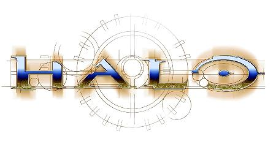

Este mes, tal y como he podido leer en [mondo-pixel](http://www.mondo-pixel.com/2007/11/05/me-parecio-ver-una-linda-gatita-en-xtreme-180/), la revista de videojuegos xtreme ha comenzado una nueva sección (o algo parecido) llamada el jodidómetro, en la que hablan de... ¿tengo que explicarlo? De juegos difíciles. Puntualizo que aún no he podido leerla porque acaba de aparecer en quioscos.

El caso es que hace unas semanas que compré [Halo 3](http://en.wikipedia.org/wiki/Halo_3). Pese a que soy un freak compulsivo de esta serie, no tuve demasiada prisa por comprarlo porque aún estaba inmerso en mi "rejuego" de la saga completa, esta vez en modo heroico. Todos los Halo tienen cuatro modos de dificultad:

*   Fácil: si juegas así no mereces que te hable,
*   Normal: que se ajusta bastante bien a lo que yo entiendo por un juego divertido,
*   Heroico: donde las cosas empiezan a ser bastante chungas desde la perspectiva de mi habilidad videojueguil, y
*   Legendario: que es un modo completamente imposible perpetrado por mentes desviadas.

Logo de Halo por Borzz, sacado de [halo.bungie.org](http://halo.bungie.org/logos.html?background=white) \[página no oficial\]

En su momento terminé [Halo 1](http://en.wikipedia.org/wiki/Halo:_Combat_Evolved) y [2](http://en.wikipedia.org/wiki/Halo_2) en modo normal, el mismo que estoy usando ahora en Halo 3. Sólo llevo unos niveles así que no puedo opinar mucho, pero parece estar bastante bien balanceado. Por ahora. El caso es que quería tener el argumento fresco en mi memoria para poder continuar. Para el que no lo sepa, la segunda parte termina en mitad de la historia, con un cliffhanger bestial debido a las necesidades de tener el juego listo en unas fechas concretas. Dado que estaba rejugándolos, preferí variar el nivel de dificultad para que la experiencia no fuera exactamente la misma, así que elegí el modo heroico. Hasta quería escribir unos buenos posts a modo de reseña de los juegos... pero es que esto ha costado más de lo que yo esperaba.

El primero lo volví a terminar. Encadené directamente con el segundo sin pasar por ningún otro juego... pero en este ya hay determinados niveles que se han torcido demasiado, y me he cansado ligeramente.

El último nivel que he terminado (el décimo, Gravemind, jugado con el [Jefe Maestro](http://en.wikipedia.org/wiki/Master_Chief_%28Halo%29)) ha sido muy (MUY) complicado, especialmente la última sección que me hizo recordar lo mucho que me costó ya en su momento en nivel normal \[por si a alguien le interesa: [walkthrough bastante completo](http://www.gamefaqs.com/console/xbox/file/562116/36745)\]. Infinitas cargas de partida después de morir siempre a los diez segundos de comenzar a moverme entre una decena de enemigos con armas que pueden desintegrarte de un único disparo.

¿Cómo? Como en todo buen juego que se precie, buscando otra forma de solucionar el problema. Ahí es donde se diferencian los juegos mediocres de los grandes, en el número de soluciones que puedes dar a una situación conflictiva. Conseguí que los [Hunters](http://en.wikipedia.org/wiki/Covenant_%28Halo%29#Hunters) me siguieran fuera de la sala principal, para deshacerme de ellos mientras el resto de enemigos seguían en su particular guerra civil. Al no estar los Hunters, [Elites](http://en.wikipedia.org/wiki/Covenant_Elite_%28Halo%29) y [Brutes](http://en.wikipedia.org/wiki/Covenant_%28Halo%29#Brutes) estaban un poco más igualados y se produjeron bastantes bajas entre ellos, las suficientes para que cuando volví a entrar ya sólo fuesen cuatro contra uno. Pardillos.

El caso es que me lo pasé. Medición de mi jodidómetro personal: por encima del ocho. Pero la pena es que después de intentarlo tantas veces (y conseguirlo) no me apetecía nada continuar. Me queda sólo un nivel con el [Inquisidor](http://en.wikipedia.org/wiki/Arbiter_%28Halo%29) y el último con el Jefe Maestro, y terminaría el juego. Otra vez. Pero ya no tenía ningún interés. Así que saqué el disco y metí la tercera parte. Si hay algo del argumento de lo que no me acuerdo ya me lo explicarán. Espero.