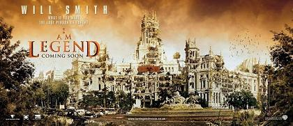

El día 19 estrenan [Soy Leyenda](http://www.imdb.com/title/tt0480249/). Yo voy a ir a verla de cabeza, más teniendo en cuenta que me estaba leyendo el libro (digo estaba porque es otro de esos libros que tengo parados a medio leer).

La imagen de arriba es uno de los carteles publicitarios (como poco sé que se ha usado en Corea), que supongo ya habréis visto todos a estas alturas, pero por si tenéis la capacidad observadora de un mandril os aviso de que lo que aparece en el cartel son la plaza de la Cibeles y el palacio de las comunicaciones de Madrid.

Vía [Uruloki](http://www.uruloki.org/felipeblog/cine-de-ciencia-ficcin/caballeros-les-presento-a-hellboy-adems-el-argumento-oficial-de-cloverfield-george-takei-en-star-trek-xi-peter-jackson-y-el-hobbit-en-3d-y-otro-puado-de-noticias-interesa), via [Worstpreviews](http://www.worstpreviews.com/headline.php?id=6742) (ahí los teneis a mayor tamaño).