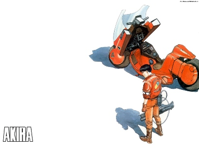

Leo en [blogdecine.com](http://www.blogdecine.com/2008/02/22-leonardo-dicaprio-y-joseph-gordon-levitt-protagonizaran-akira) que la Warner va a rodar una versión de imagen real del clásico de la animación [Akira](http://www.imdb.com/title/tt0094625/). Dividirán la película en dos partes y cambiarán Neo-Tokio por Manhattan (claro). [Leonardo DiCaprio](http://www.imdb.com/name/nm0000138/) en el papel de Kaneda. La mejor película de animación de la historia del cine convertida en un chiste.

2.212 planos con más de 160.000 ilustraciones individuales (casi el triple de lo habitual), usando 327 colores distintos (50 de los cuales se crearon específicamente para la película)... convertidos en una película de DiCaprio. Ni mencionaremos que, obviamente, el tebeo ya está en otra dimensión de calidad diferente.