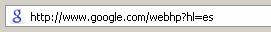

Google ha cambiado su favicon (el icono que te sale en los navegadores en la barra de direcciones). Me parece que fue el pasado viernes:

Ahora no es la G mayúscula sino la minúscula (la segunda). Yo no sé si soy el único que se fija en estas tonterías...