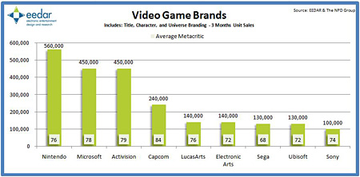

Repasando el resumen semanal de noticias que me envía [Gamasutra](http://www.gamasutra.com/), veo esta gráfica de venta de primeras marcas durante los últimos tres meses \[[enlace a la noticia](http://www.gamasutra.com/php-bin/news_index.php?story=19077)\]. Con primeras marcas me refiero a juegos desarrollados como first o second-party por una compañía: Microsoft con Halo, Nintendo con Mario, Pokemon o Zelda, etc.

Me sorprenden bastantes cosas, como que UbiSoft esté tan baja de ventas, aunque es de suponer que se recuperará con alguna franquicia próxima (no recuerdo para cuando es el próximo Prince of Persia), pero lo que desde luego sí es preocupante es la posición de Sony, que no está desarrollando prácticamente nada propio (o nada propio con un renombre que proporcione ventas), y ha plantado una máquina en el mercado que depende al 100% de los third-party developers.

Me pregunto cómo estarían las ventas si finalmente Metal Gear hubiese sido multiplataforma...