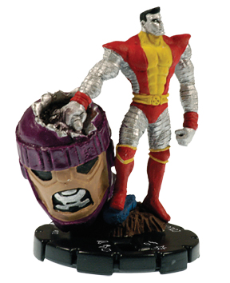

Antes de verano ya habíamos estado echando unas partidas a [HeroClix](http://www.wizkidsgames.com/heroclix/), y ahora que ya terminan las vacaciones podemos volver al nuestra ardua labor de subculturalizarnos. Si vas a seguir leyendo, deberías asumir que sí, soy un friki. Es lo que hay.

Foto de la partida de ayer ([X-Force](http://en.wikipedia.org/wiki/List_of_X-Men_teams#X-Force) contra **Spiderman y unos amigos** que pasaban por allí) (tomada con el iPhone, desde donde empecé a escribir el post en un momento de aburrimiento de hoy) \[sólo tiene 2 MegaPixels, pero me basta y sobra\]

**¿Qué es eso del** **jiroclis?** Pues un vicio malsano como cualquier otro, en este caso un juego de estrategia con figuras de distintas ambientaciones que comparten un mismo conjunto de reglas. La lógica (y el modo de distribución de la compañia), dicta que son figuras coleccionables, que se venden en paquetes cerrados con figuras al azar (generalmente paquetes de cuatro, exceptuando kits de iniciación y similares).

**El mundo real**, al menos en mi caso, dice que es una pérdida de tiempo y dinero comprar paquetes al azar porque cada expansión del juego pueden ser muchas miniaturas (quizá 40 o 60), por lo que las probabilidades de que te toquen figuras que no quieres para nada es muy alta. La otra opción es comprarlas sueltas en tiendas que se dediquen a la compra/venta de este tipo de frikadas... o **eBay**, que es lo que yo recomiendo, donde todo está más barato y puedes comprar lo que quieras.

**¿Precios?** No demasiado caro, viendo como está el coste de la vida hoy día... paquetes cerrados son menos de 10 euros, y las figuras sueltas fluctúan entre los 50 céntimos y los 150 euros (piezas de coleccionista que nadie necesita para nada). Para poner un ejemplo más real, la mayor parte de mis figuras me habrán salido por entre uno y tres euros, más algún capricho suelto y esporádico por algún personaje especial que no creo que haya pasado de seis u ocho euros.

Naturalmente, mi perfil como jugador es muy diferente al normal. Yo juego por frikismo tebeil, no por mejorar las probabilidades de victoria del equipo que utilizo, por lo que compro personajes de un mismo "equipo" (por ejemplo [X-Men](http://en.wikipedia.org/wiki/X-Men), [Hermandad de Mutantes](http://en.wikipedia.org/wiki/Brotherhood_of_Mutants) o similares), independientemente de lo malas que sean... mientras que algunas buenas no me las permito porque son caras. Eso hace que nunca pueda jugar con los [Vengadores](http://en.wikipedia.org/wiki/Avengers_(comics)), porque me faltan algunas fijas en el tebeo que son muy caras en plástico, y no voy a pagar ciertas cifras.

**¿Qué juegos hay disponibles?** Unos cuantos. Con el mismo concepto de juego han fabricado: **MageKnight** (fantasía medieval de toda la vida), **MechWarrior** (ci-fi basada en la franquicia del mismo nombre), **Heroclix** (en tres "sabores" diferentes: Marvel, DC e Indy), **ActionClix** (por ahora el universo de los videojuegos de Halo) y **HorrorClix** (que tiene bastante buena pinta e incluye figuras de muchas películas y ambientaciones de terror, así como algunas cajas de Aliens y Predators muy bien diseñadas).

**Algo de información \[[wiki](http://en.wikipedia.org/wiki/Heroclix)\]:**

En su diseño han participado algunos pesos pesados del diseño de juegos de rol, como [Monte Cook](http://en.wikipedia.org/wiki/Monte_Cook) o [Jeff Grubb](http://en.wikipedia.org/wiki/Jeff_Grubb), aunque últimamente parece estar tomando algunas líneas un poco diferentes que mejoran algunas de las carencias que tenía como juego.

El sistema se basa en que las miniaturas llevan en su base un dial que hace evolucionar su comportamiento a lo largo de la partida, principalmente **cada vez que se llevan una colleja** por parte de otro personaje. En ese dial sólo se ven las estadísticas de la figura en ese momento. Algunos personajes (la mayoría) irán teniendo números cada vez más bajos según pase el tiempo, otros mejorarán o simplemente irán cambiando. Algunos de esos números aparecerán de un color, lo que representará algún tipo de habilidad especial (superpoderes en Heroclix) que podrá utilizar mientras el color siga visible.

Cuando enfrentas a una miniatura contra otra, unos números más una tirada de dados (el componente de azar del juego) tendrán que superar a otros números de la otra miniatura. Y poco más, porque tampoco tiene mucho más misterio. El componente estratégico es el mismo que cualquier otro juego similar, saber distribuir a tus piezas por el tablero y conocerlas para saber cómo irán evolucionando de forma que puedan responder a las distintas maniobras y habilidades del equipo contrario.

Para nivelar las partidas cada miniatura tiene un valor de puntos, por lo que la suma de todas las tuyas debería ser similar al total del contrario (y eso, en teoría, debería bastar).

**Problemas y virtudes:**

*   **Malo**: Existe un determinado punto en el que entras en una espiral de destrucción y ya sabes que vas a perder. Es tontería seguir jugando a partir de aquí porque si tienes dos miniaturas y el contrario cinco ya estás perdido, lo que impide bastante que un jugador se recupere tras desnivelarse la partida. Han presentado un nuevo conjunto de reglas más simples que parece que soluciona esto, lo probaré a ver que tal.
*   **Solucionado**: En las primeras expansiones las figuras se distribuían con la base pintada en tres colores (amarillo, azul y rojo, representando la experiencia o el momento histórico en el tebeo), aunque la figura solía ser la misma. Eso daba lugar a incongruencias argumentales como tener personajes con un traje antiguo perteneciendo a un grupo moderno. Menudencias para el jugador pero **ofensas para el fan**. En las expansiones modernas eso ha cambiado y ya hay una sóla versión de miniatura por expansión.
*   **Malo**: No es difícil que la partida se alargue hasta una hora o dos con apenas media docena de figuras por bando, lo que puede tirar para atrás a muchos jugadores. El nuevo conjunto de reglas también trata de solucionar esto. Habrá que verlo.
*   Si los dados están rotos y sólo sacas resultados malos vas a perder. A mí siempre me pasa. Claro que este tipo de juegos siempre se me han dado mal, y puede ser por eso.
*   **Muy bueno**: Las miniaturas ya están pintadas, montadas y con todos los datos listos para jugar apuntados en la figura (en las más modernas vienen acompañadas de una carta con esos datos para facilitar aún más la partida).
*   **Muy malo, medio solucionado**: Lo peor que le pasó nunca a este juego fué contar con unos modeladores horrendos para las primeras expansiones, lo que dió lugar a figuras muy, muy, muy, muy, muy feas. Se ha ido solucionando parcialmente, con algunas expansiones muy chulas y muy bien pintadas, aunque aún se les cuela de vez en cuando algo horrendo. Hay que terminar de mejorarlo del todo.
*   **Inherente al juego**: Las versiones buenas y poderosas de **algunos** personajes son figuras muy raras (Thor, Ares, Capitán América, etc), por lo que pueden alcanzar un cierto dinero en el mercado. Algunos tienen versiones "menos buenas" y más comunes, pero otras no (como Ares, argh), así que puedes quedarte sin jugar con ellas a menos que quieras gastarte dinero o arriesgarte a comprar paquetes aleatorios.
*   **Muy, muy bueno**: poder fliparte con el juego y ponerle vocecillas a los personajes cada vez que hacen algo decente. Y no digáis que no lo haríais.