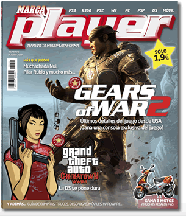

Varios puntos a tener en cuenta: **no me ha interesado leer absolutamente nada**. Ni los artículos, que es lo que suele salvar otras revistas del sector. Entrevistas insulsas y mal traducidas. Muchas cosas sacadas de páginas web (ign, akihabara blues... para eso no compro papel). Notas (\*sigh\*). Notas por encima del ocho en el 90% de los casos (¿qué esperábamos?).

Publicidad por todas partes. Publicidad de algunas cosas y algunos juegos lamentables, como si fuera una mala página web con anuncios contratados a una empresa de marketing sin muchos conocimientos. Logotipos de Burguer King cada cuatro páginas... un despropósito.

Y dejo para el final lo más interesante: el **diseño gráfico**. **Madre de mi vida**. Me recuerda los tiempos de "aprendamos a hacer una página web en geocities en diez minutos", pero en una revista impresa. Tipografías escogidas sin ningún criterio.

Diseños cutres e incluso de aficionado al photoshop. Maquetación de página muy confusa, que no deja muy claro a dónde hay que mirar o qué parte de la página es más importante (tardé un rato en encontrar de qué consola era una reseña, por poner un ejemplo).

Creo que hay dos opciones: o bien el jefe de diseño de esta revista no debería dedicarse a esto o bien **yo no tengo el más mínimo criterio**.

> Una compra y no más, Santo Tomás.