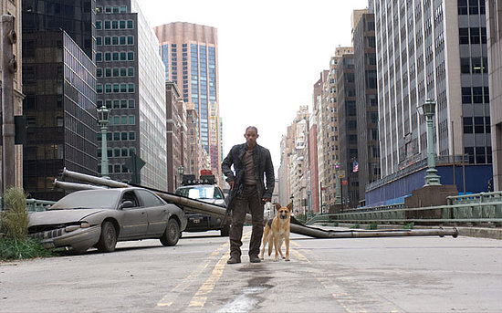

Hace ya un tiempo que tenía rondando por casa el dvd de [Soy Leyenda](http://www.imdb.com/title/tt0480249/) con las dos versiones existentes de la película (y aún sin desprecintar, como tantas otras). Aprovechando la excelente oferta televisiva española, ayer fue día de cine en casa. Y como tengo un blog y puedo haceros perder el tiempo paso a contar algunas impresiones sobre la película y sobre los dos finales existentes. **Hay _spoilers_**.

**Hecho innegable número uno**: esta película se llevó muchas críticas negativas innecesarias, por parte de mucho aficionado de tres al cuarto que no sabe lo que va a ver, en lo que yo llamo el "_Síndrome Señales_".

> **Síndrome Señales**: lo que le sucedió a dicha [película](http://www.imdb.com/title/tt0286106/) (la de Shyamalan, con Mel Gibson) cuando muchos fueron a verla pensando que iba sobre una invasión extraterrestres y esperaban ver Independence Day. Todo internet está lleno de críticas cuyo fundamento se basa en "es que no explican nada de los marcianos", "es que no cuentan qué pasa con la invasión" y/o "es que esos marcianos hacen tal y cual o son tal y cual y no debería ser así".
> 
> Señales trata sobre un pastor que ha perdido la fe y cómo la recupera. El resto es accesorio. Se podría contar la misma historia sin ningún toque de ciencia-ficción y los personajes y las situaciones seguirían siendo los mismos, por ejemplo cambiando los alienígenas por un asesino en serie que llega al pueblo. Las señales que dan título no son los campos de maíz, sino las que Gibson ve en cada uno de los hechos que ocurren, en cómo encajan como un patrón en su mente y le ayudan a recuperar la fe perdida.
> 
> Si somos consecuentes y nos ceñimos a eso como el verdadero argumento de la Señales, lo cierto es que es bastante decente (y a mí, particularmente, me gustó mucho).

**Hecho innegable número dos**: Soy leyenda está muy bien ambientada y **tiene una atmósfera excelente**. Aún siendo una película que ya había visto, consiguió meterme en la historia por completo, sin situaciones absurdas que me saquen de la narración (voy a exceptuar la escena del diálogo de Shreck, que con un par de frases habría causado el mismo efecto sin chirriar). Los momentos de tensión son excelentes, los flashbacks para dar drama (en realidad sólo uno contado en fases) son congruentes con la historia y nos dan una razón para que el protagonista esté donde está y haga lo que hace. Y, para mí muy importante, no añade metraje innecesario para agradar a sectores del público: cuando llegan la mujer y el niño, no hay historia de amor, no hay momentos de protagonismo de los nuevos actores, y no alargamos metraje a lo tonto con historias dentro de la historia... llegan, se hace de noche, y ya estamos en el final de la película.

**Hecho innegable número tres**: La actuación de Will Smith **es más que decente**. Hay quien sigue viendo al príncipe de Bel-Air y es incapaz de tomarse una escena en serio, pero si yo veo una película cuyo mayor porcentaje de metraje está cimentado exclusivamente en la actuación de un único actor (como pasaba en, por ejemplo, Naúfrago) y consigue parecerme un film divertido y entretenido, sólo puede querer decir que el trabajo de ese actor es bueno. No hace escenas de comedia, y tiene momentos dramáticos (el sacrificio del perro) y de tensión y miedo (la entrada en el edificio a oscuras) donde su actuación es muy buena y mejora su repertorio.

**A+B+C = La película es buena**. No me vais a sacar de mis trece, así que no intentéis convencerme de lo contrario.

Por otra parte, algo que no todo el mundo sabe es que el final estrenado en cines no es el final original. De hecho, no es el desarrollo argumental original, porque los detalles afectan a más partes de la película: las conclusiones que puedes sacar como espectador tras ver cada una de las versiones son completamente distintas:

> **Versión estrenada en cines**: El protagonista es un investigador del ejército que se queda en la zona cero donde comienza el contagio. Se convierte en un maestro en lo que a supervivencia se refiere pero vive sólo durante varios años, lo que empieza a afectarle seriamente. Trata de investigar una posible cura para acabar con la enfermedad y devolver a los "infectados" a su estado normal, para lo que hace ensayos clínicos en algunos de ellos, a quienes captura. Lo que parece ser una versión más evolucionada e inteligente de vampiro le persigue hasta que, finalmente, acaba muriendo tras descubrir la cura, sacrificándose como un héroe para que otros sobrevivan. La chica y el niño se llevan la cura hasta una zona donde han sobrevivido otros humanos. **Final feliz y heroico.**

> **Versión original**: El protagonista es un investigador del ejército que se queda en la zona cero donde comienza el contagio. Se convierte en un maestro en lo que a supervivencia se refiere pero vive sólo durante varios años, lo que empieza a afectarle seriamente. Trata de investigar una posible cura para acabar con la enfermedad y devolver a los "infectados" a su estado normal, para lo que hace ensayos clínicos en algunos de ellos, a quienes captura. _Su última captura es una chica a quien mantiene con vida para probar distintos productos sin demasiado éxito._ Lo que parece ser una versión más evolucionada e inteligente de vampiro le persigue _hasta que averiguamos que no quiere matarle, sino recuperar a su pareja, la chica capturada. El doctor llega a una especie de trato liberando a su captura a cambio de su vida. Descubrimos que no están completamente involucionados, sino que tiene su propia jerarquía social y sentimientos, lo que llena de culpa al doctor, que se ve como asesino de múltiples de estos vampiros, centrando la atención del espectador en todas las fotos de "pruebas" en la pared del laboratorio. Finalmente los tres humanos huyen de la ciudad, pero siguen estando sólos y no existe ninguna zona conocida donde hayan sobrevivido humanos. Siguen intentando comunicarse por radio con posibles supervivientes._ **Final triste y victimista.**

Además de estas diferencias hay otras, como las distintas señales en forma de mariposa que se encuentran: en la versión comercial es un símbolo que hace su hija y aparecen en las roturas de un cristal. En la versión original es un tatuaje de la vampira y un dibujo hecho en el cristal por el vampiro. La versión original no está doblada pero es completa: los efectos están terminados, sin escenas "a medio hacer", lo que deja bastante claro que la idea original era estrenarla tal y como se hizo y que, a posteriori, fue necesario grabar nuevo metraje para cambiar la historia.

**¿Y qué nos dice esto?** Pues que el mensaje final que la película transmite es completamente distinto en un caso y otro. La versión finalmente estrenada en cines nos muestra una historia mucho más heroica, donde el protagonista se sacrifica para salvar a otros y por el bien común, y donde la historia es mucho más maniquea: los buenos son buenos, los malos son malos y, en caso de conflicto, no es posible el "intercambio cultural", sino únicamente matar o morir.

En la versión original, sin embargo, el final está mucho más abierto a interpretaciones, no queda tan claro que los buenos fueran tan buenos, ni que lo hecho haya sido tan positivo. El futuro está más abierto, al destruirse el laboratorio y no encontrarse otros supervivientes... aunque el protagonista sigue vivo y puede continuar su trabajo.

Cada cuál tendrá que decidir cuál le gusta más.