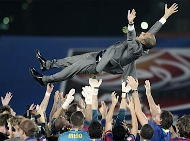

*   **Único club europeo que ha jugado competiciones continentales (UEFA) todos los años** desde que se instauraron en 1955.
*   Primer club español en conseguir el triplete Copa del Rey + Liga + Champions.
*   Equipo con más títulos españoles (104).
*   Uno de los únicos cuatro equipos profesionales españoles que aún no son sociedad anónima y uno de los tres que nunca han descendido de categoría.
*   19 ligas (22 subcampeonatos), 25 copas (8 subcampeonatos), 8 supercopas de España.
*   1 Intercontinental (por fin), 3 Copas de Europa, 4 Recopas de Europa, 3 Copas de Ferias (UEFA) y 3 Supercopas de Europa.
*   Estadio más grande de Europa, con 98.772 asientos.
*   Segundo club del mundo con más socios (170.000, sólo por detrás del Benfica).
*   **[Mejor club histórico del mundo según la IFFHS](http://www.iffhs.de/?bd4d443d0b803e8b40384c00345fdcdc3bfcdc0aec28d6edbe1d)** , desde que se tienen en cuenta todos los resultados de ligas, copas y competiciones continentales de las seis confederaciones de fútbol... algo que se hace desde 1991 (casi veinte años).
*   **Equipo con más podios y ganadores en el FIFA World Player** (15 podios, 6 ganadores, y falta este año) **y en el Balón de Oro** (23 podios, 9 ganadores).

Y, por supuesto, **primer equipo del mundo en conseguir las seis competiciones oficiales**: _Copa nacional, Liga nacional, Supercopa nacional, Copa Continental (Champions), Supercopa Continental y Copa Intercontinental (Mundial de Clubes)_.

Qué cosas...