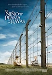
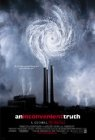
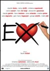
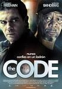
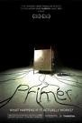

**[El niño con el pijama de rayas](http://www.imdb.com/title/tt0914798/)** (_The boy in the striped pyjamas_, 2008)

Una nueva '_La vida es bella_', pero sin intentar hacer gracia en ningún momento y sin tener la más mínima esperanza de un "final feliz". Desde el primer minuto se ve que no va a acabar bien, y se regodea en su melodrama aún cuando parece presentar los hechos desde la perspectiva inocente de un niño. Pero como es un drama debe ser un peliculón, que es el criterio cinematográfico básico del ciudadano medio. Por mi parte prefiero dejarla en aceptable y excesivamente lacrimógena.

[**Un buen día lo tiene cualquiera**](http://www.filmaffinity.com/es/film520526.html) (2007)

Otra película española rodada al amparo de las infinitas ayudas y préstamos que damos entre todos para que cuatro puedan estrenar películas. Yo no llegué a verla nunca anunciada en ningún sitio ni estrenada en ningún cine. Y es que es un petardo bastante infumable, otra de esas que se han puesto tan de moda en el que las desventuras de completos inadaptados sociales deberían hacernos gracia... porque el director cree que es una comedia. De no ser por las gracias del anciano jubilado no habría terminado de verla, porque frases como "_Si vamos a jugar hazlo bien, porque para perder el tiempo me pongo a bajar politonos_", son impagables. Pero como obra global, una desgracia.

Extrañamente muchas de las críticas que encuentro por Internet la clasifican de "personalísima obra de arte" en un alarde de lo que claramente el Señor Lobo definiría como "_no empecemos todavía a chuparnos las pollas_".

**[Una verdad incómoda](http://www.imdb.com/title/tt0497116/)** (_An inconvenient truth_, 2006)  

El documental de _Al Gore_ basado a medias en la (estupenda, se nota que es un profesional) charla sobre el tema que va dando por el mundo y en algunos añadidos para la edición en Dvd. Es ameno, es irrefutable, y deja claras bastante cosas. Todo el mundo debería verlo.

[**Ex: Todos tenemos uno**](http://www.filmaffinity.com/es/film610421.html) (_Ex_, 2009)

Película italiana (y con esto estoy diciendo mucho más de lo que parece) de varias historias levemente entrecruzadas sobre parejas que se crean, se rompen o se arrejuntan de nuevo. Siguiendo otra moda muy implantada, los hombres son seres mezquinos que abandonan a sus parejas por deseos egoístas y ellas son seres perfectos que jamás les han hecho daño a nadie... incluso en la historia en que una mujer abandona a su prometido en el mismo altar, los hechos se nos presentan de ese modo. Yo creo que el mundo debe estar siendo víctima de algún tipo de conspiración propagandística en contra de los hombres sin que nos demos cuenta. Por lo demás no está mal, podría ser calificada como comedia romántica a pesar de no tener casi nada de comedia y prácticamente nada de romance. Se deja ver.

**[The Code](http://www.imdb.com/title/tt1112782/)** (_Thick as thieves_, 2009)

En serio, no entiendo por qué se traduce un título en inglés a otro título en inglés. _Antonio Banderas_ y _Morgan Freeman_ en una película sobre ladrones aburrida y sosa. Se buscan excusas estúpidas para que puedan robar por razones moralmente aceptables (como si fuera necesario), se dan dos giros finales que tratan de amenizar y llamar la atención del espectador, pero... siendo sinceros, me puse a leer el periódico mientras la película estaba puesta porque me aburría. Prescindible.

**[Primer](http://www.imdb.com/title/tt0390384/)** (2004) **revisionado**

Por un lado he de decir que es ciencia-ficción de la buena. Por otro que como producto le falta un hervor. Los primeros quince minutos de presentación de los personajes se hacen eternos por no mostrar realmente nada de interés para la historia. Y hacia el final las cosas se tuercen demasiado pero quedan sin explicar por ser mostradas desde un punto de vista concreto, únicamente de unos determinados protagonistas. Y el final propiamente dicho adolece del mismo problema, sin que quede muy claro qué protagonistas han quedado en qué momento/lugar y planteando un final enormemente abierto para que el espectador se marque sus propias dudas.

Con un equipo técnico de unas cinco personas (y no es una exageración, son las que aparecen en los créditos), y media docena de actores, la verdad es que el resultado está muy por encima de la media. Recomendable, pero sólo para mentes acostumbradas a las dudas sobre determinismo y paradojas. Es decir, lectores de ciencia ficción. Al resto les parecerá un pestiño.