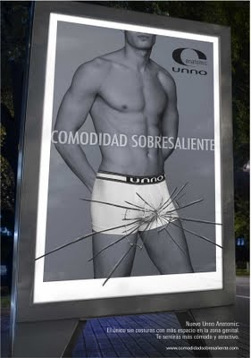
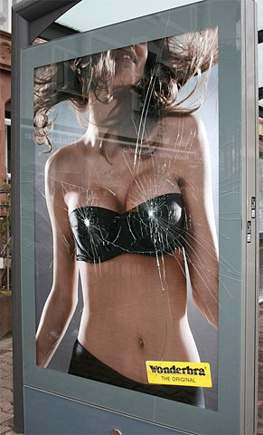

Anuncios de _Unno_ que están en Madrid ahora mismo (2010), y será de las pocas veces que veréis hombres en ropa interior en este blog:

Publicidad de _Wonderbra_ [del año 2008](http://www.puromarketing.com/24/4949/la-nueva-campana-wonderbra-mas-explosiva-que-nunca.html):

  

  

Y sí, ya sé que tanto _Unno_ como _Wonderbra_ pertenecen al mismo grupo empresarial, pero la verdad es que me parece que mucho no nos estamos rompiendo los cuernos, la verdad.