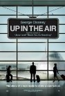
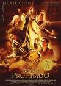
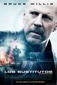
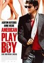

[**Up in the air**](http://www.imdb.com/title/tt1193138/) (2009)

Confundiendo a algunos, que han tomado los anuncios de esta película como los de una nueva comedia de enredos románticos de _George Clooney_, se cuela una mezcla entre drama humano y tragicomedia (dependiendo del humor que tengas ese día) sobre el aislamiento y la soledad del individuo. O de la capacidad de disfrutar de la vida sin que nadie la interfiera, todo depende del punto de vista.

Entretenida e incluso ilustrativa, aunque no me parece que sea como para tener nominaciones al Oscar para todos sus actores (protagonista y dos actrices secundarias).

**[Malditos bastardos](http://www.imdb.com/title/tt0361748/)** (_Unglorious Basterds_, 2009) **descartada, no he visto el final**

Aún a riesgo de ser apedreado por las filas de _zomb_... de fieles fans de _Tarantino_, he descartado por completo la película a la mitad de metraje. Tan sencillo como darle al _stop_ y ponerme a ver otra cosa, que la vida es corta. Tras un par de películas muy buenas que le granjearon la merecida fama, la filmografía de _Tarantino_ ha caído en picado a un ritmo vertiginoso. Técnicamente impecable, como todo lo que hace, pero sin ninguna historia que contar, como en sus últimas producciones.

Minutos enfocando a un túnel negro para ver cómo sale una persona con un bate de béisbol y mata a golpes, puestos en pantalla con una extrema violencia innecesaria para la historia que se está contando, a unos tipos cuya importancia para el argumento es prácticamente nula. Escenas, tras escenas, tras escenas, de minutos tirados a la basura que no cuentan nada. Cuando la conversación en el sótano del bar llevaba más de diez minutos de película, con todos los protagonistas jugando a un juego de cartas, la paré. No me importa la partida, no me importa que hayas escogido como personaje a _King Kong_ y los otros personajes tengan que adivinarlo, para eso puedes rodar durante media hora una partida de parchís y vender entradas para que todo el mundo la vea, pero no me atrevería a calificarlo de buen cine. Si esa es tu única forma de intentar transmitir tensión a la escena, no lo has conseguido, sólo consigues que el espectador se salga de la narración y se destruya la inmersión.

Minutos, y minutos, y minutos sin contar nada. Rellenando para alcanzar un metraje infinito innecesario. Deleitándose en la puesta en escena extremadamente plástica de una violencia sin medida. Una violencia que transmitiría un mayor desasosiego si no se viera, si ocurriera fuera de encuadre... una violencia sin objetivo argumental. Tras hora y media de película aún no había pasado nada.

Y, para rematar, históricamente es absurda, y no hace más que perpetuar la relación entre los conceptos de nazi y soldado alemán (- _¡vamos a matar nazis!_ - No, vais a matar soldados alemanes y, hacia el final, supongo, algún nazi en el cine, aunque me quedé sin saber cómo termina). Esto podría tener un pase, igual que puedo disfrutar de _300_ puedo disfrutar de cualquier cosa que sea históricamente incoherente, era por añadir hambre a las ganas de comer.

Hice bien en no pagar dinero para verla en el cine. Sabía de qué iba a ir el tema.

**[El reino prohibido](http://www.imdb.com/title/tt0865556/)** (_The Forbidden Kingdom_, 2008)

Sorprendentemente, de una película que no esperaba nada ha sido de donde más disfrute he obtenido. Es una tontería de las de siempre: chico se ve transportado a mundo fantástico, chico resulta ser el elegido para algo, chico encuentra maestros que le guían (_Jackie Chan_ y _Jet Li_), chico debe enfrentarse a su destino y, de paso, salvar el mundo.

Por el camino, peleas con gran coreografía al estilo _Hong Kong_ (de las que se nota el efecto de los cables), confusiones entre los protagonistas como en cualquier buen tebeo de superhéroes (si no, ¿cómo íbamos a dar la excusa para ver un enfrentamiento entre los dos maestros?) y una historia mística sobre un mundo perdido tan manida como vistosa. Hay un personaje femenino que sobra, pero eso permite meter otro enemigo femenino, que también sombra, y así ver a las actrices dándose de leches, como es habitual.

Es lo de siempre, pero supongo que en su falta de necesidad de sentar cátedra, en lo simple del mensaje y lo directo de la acción, desde los primeros minutos, es donde tiene sus virtudes. Divierte, y punto.

**[Los sustitutos](http://www.imdb.com/title/tt0986263/)** (_The Surrogates_, 2009)

Para pegarse un tiro. Nace de principios completamente erróneos que cualquier autor de ciencia ficción seria habría sabido ver. Todo el planeta ha dejado de vivir "en persona" para quedarse encerrados en sus casas viviendo las experiencias diarias a través de un androide controlado remotamente, conocido como un "sustituto". Según los guionistas, esto redujo los crímenes en un 99%. Esto es una falacia como la copa de un pino. Es obvio que la falta de consecuencias en tus actos no haría que todo fuera más seguro, sino mucho más salvaje. Un asesinato ya no sería asesinato, sino un ataque a la propiedad (igual que romper la tostadora del vecino). Una violación no tendría más consecuencias que matar al personaje de _World of Warcraft_ de un conocido. La criminalidad en la calle se dispararía, y el mundo real sería más peligroso que cualquier otro lugar. Sería necesario cambiar el sistema legislativo y judicial al completo, y las ramificaciones sociales de estos profundos cambios modificarían el modo de vida diario como ahora no podemos ni imaginar.

Extrañamente, aunque se ha descubierto una tecnología realmente increíble, capaz de dotar a los androides de un control remoto inalámbrico, de fuerza y reflejos sobrehumanos, y de haber introducido cambios sociales que cambiarían radicalmente el comportamiento humano, las personas siguen viviendo exactamente igual. Los trabajos siguen siendo los mismos. Todo el mundo sigue yendo a discotecas (no tengo muy claro para qué), se siguen conduciendo _Toyota Prius_ y se siguen utilizando móviles _GSM_. Tecnológica y socialmente las bases de la película son el mayor descalabro que he visto en ciencia ficción en mi vida.

Tras contarnos que todo el mundo vive a través de sus sustitutos, también nos cuentan que existen grandes comunidades de gente que vive agrupada en algo que no tengo muy claro si son comunas o campos de concentración, donde no dejan entrar a los sustitutos. No queda claro si esas zonas ya no tienen control gubernamental ni ley, si son independientes, o qué, pero es lo que parece, y no tiene credibilidad alguna. No veo factible que mañana un grupo de _antisistema_ pueda declarar independiente un barrio entero de alguna gran metrópolis norteamericana y que su gobierno no hiciera nada al respecto.

Esta gente vive en una especie de integrismo religioso dirigidos por 'El profeta' (sin nombre de pila, al contrario que en el mundo real, donde los profetas sí tienen nombre), que les impide utilizar esta tecnología... pero sí usan coches, furgonetas, escopetas o ametralladoras. Y viven entre la mugre más absoluta, como si fuese un requisito para ser antisistema, o si la prohibición de los sustitutos también afectase a aspiradoras, escobas, duchas, o camiones de recogida de basuras.

Y en cuanto a la película en sí... una de _Bruce Willis_, de personaje típico a más no poder, con la historia triste como contrapunto para que _Willis_ pueda poner su cara de trauma infantil. Se ve venir a la legua, es obvia hasta límites insospechados y, al final, aburre.

Final que, por cierto, no tiene sentido \[**spoiler alert!!**\]. Que se caiga la red que controla a los sustitutos no significa nada. El _hardware_ de todos los androides no se ha visto modificado, sólo hay que darle al botón de _reset_ y volver a empezar. Vaya truño inconsistente de final.

**[American Playboy](http://www.imdb.com/title/tt1186370/)** (_Spread_, 2009, toma cambio de título)

Película para lucimiento de _Ashton Kutcher_, para que salga medio en pelotas fornicando en múltiples posturas con varias mujeres y se engrandezca su ya de por sí desmesurada fama en Estados Unidos (¿Sabíais que es el usuario con más seguidores de _Twitter_ del mundo? Ahora ya lo sabéis).

Si he de compararla con alguna otra película, para que os llevéis una idea sobre esta, debería ser con el _Alfie_ de _Jude Law_. Con la diferencia de que _Alfie_ mola, y este tipo no. Y el "mal final" de _Alfie_ en realidad es perfectamente interpretable como bueno, mientras que el "mal final" de _American Playboy_ no. Aunque hay quienes discrepan conmigo y creen que el mal final de _Alfie_ es realmente malo, como si ser un gigoló triunfador con el mundo a tus pies, volviendo a empezar desde cero, tuviera algo de malo.

Psé, ni fu ni fa.

**[Enemigo Públicos](http://www.imdb.com/title/tt1152836/)** (_Public Enemies_, 2009)

Otro truño infumable. Recapitulemos. Una fotografía que hace que la película luzca como un episodio de _Cuéntame_. Dos protagonistas cuyas líneas argumentales no se cruzan más que en diez segundos, y cuya historia, personalidad o motivaciones desconocemos. Unos secundarios confusos que aparecen y desaparecen por arte de magia (_Giovanni Ribisi_ es el caso más alarmante, apareciendo en un par de ocasiones contándonos unos planes de atraco a un tren, perdiendo minutos y minutos de metraje... ¡¡para un atraco que no llega a narrarse!!). Personajes confusos en los que no queda muy claro quién es quién (pienso específicamente en la gente que lleva la casa de apuestas telefónica, que nunca queda claro de parte de quién están ni para quién trabajan). Y si queda claro yo no me he enterado, así que asumo que muy bien explicado no estará.

_Johnny Depp_ está muy lejos de hacer el papel de su vida, y _Christian Bale_ pasa los minutos con una expresión plana que no transmite nada.

Aburrida, lenta y prescindible.

**[Gamer](http://www.imdb.com/title/tt1034032/)** (2009)

Podría haber estado bien, pero se queda en poca cosa. Probablemente su mayor pecado sea estar dirigida por alguien con ganas de realizar videoclips, porque las tomas suelen ser confusas y demasiado movidas, en un intento de mostrar ese futuro distópico de vida rápida, luces fluorescentes y música electrónica.

Tiene persecuciones, tiros y explosiones, lo que siempre está bien, pero se pierde en sus paralelismos. El "malo final" que tendría sentido en un videojuego no lo tiene en una película (aunque muchos me discutirían esto), porque el protagonista es un experto combatiente y el "malo" es un sosías de _Bill Gates_, en el que el actor que da vida a _Dexter_ no consigue hacerme ver el personaje entre tanto exceso e histrionismo. Con la cantidad de gente que se cargan, si realmente querían deshacerse de _Gerard Butler_, hubiese sido más fácil pegarle un tiro y echar el cadáver a un río que montar toda esta parafernalia.

Blegh. Y el papel del chico que "controla" al protagonista... Blegh.

No me ha gustado casi nada de lo que he visto últimamente.