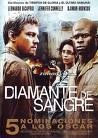
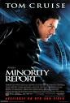
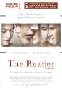
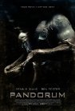
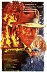
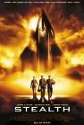

Como se me acumulan las _microreseñas_, tendrán que ser cada vez más micro.

**[American Gangster](http://www.imdb.com/title/tt0765429/)** (2007) **revisionado**

La vi en su momento en el cine y no ha mejorado ni empeorado mi impresión desde entonces. Gran trabajo de _Ridley Scott_, aunque se me sigue haciendo algo larga para las pocas cosas que cuenta. Un poco simplón _Russel Crowe_ y un poco sobreactuado _Denzel Washington_... es decir, ambos en su línea de los últimos años. Recomendable sin ser una joya.

**[Diamante de sangre](http://www.imdb.com/title/tt0450259/)** (_Blood Diamond_, 2006)

Esta se me ha resistido varios años, los planes para verla siempre se iban al traste. Se hace necesario ignorar algunas cosas... los pequeños detalles de moralina que van salpicando la película, el insufrible deje de _Leonardo DiCaprio_ (que acaba todas sus frases con un _¿eh?_) y algunas decisiones argumentales indefendibles, como que uno de los personajes protagonistas "abandone" la historia a falta de bastante cosas por pasar, provocando una lenta escena de despedida en mitad de lo que debería ser la acción. Para seguir con escenas _Disney_ de personajes caminando por las montañas, para enseñarnos lo bonita que es África sin venir a cuento. Lo dicho, una sutil capa de moralina de cuando en cuando. Se deja ver, dentro de lo que cabe.

**[Tú la letra y yo la música](http://www.imdb.com/title/tt0758766/)** (_Music and Lyrics_, 2007)

Indefendible. Pasa más de una hora de película y aún no hay conflicto entre ningún personaje. Es absurdo intentar realizar una comedia romántica sin conflicto, sin nada que suceda entre los protagonistas. Es... en serio, es absurda. Lo peor que he visto de _Hugh Grant_, y lo peor que he visto de _Drew Barrymore_. Lamentable.

**[Minority Report](http://www.imdb.com/title/tt0181689/)** (2002) **revisionado**

Una historia de _Dick_, con dirección de _Spielberg_ y actuación de _Tom Cruise_, debería haber dado para mucho más. Sí, tiene muchas cosas buenas, pero se queda en mucho menos de lo que podía haber sido. Podían haberse lanzado más a la piscina, y haber intentado navegar un poco más en las aguas del determinismo o no-determinismo, explorando los verdaderos problemas de condenar a alguien que no ha llegado a cometer un crimen, de si tendría sentido sólo avisarle con anterioridad, y de si era o no posible cambiar el futuro cuando sabes lo que vas a hacer. Pero se queda en una peli de acción. Y con un par de escenas con una loca gritando que, a todas luces, sobran. Aunque la primera persecución entre _Tom Cruise_ y _Colin Farrell_ es puramente Indiana Jones, y es, de largo, lo mejor de la película.

**[El lector](http://www.imdb.com/title/tt0976051/)** (_The Reader_, 2008)

Extraña. Intenta crear una sensación de empatía contándonos varias etapas vitales del personaje, pero el cambio de un momento a otro es demasiado brusco, haciendo que parezca que nos cuentan otra película distinta. Muy buena la primera parte (juventud), con grandes personajes; muy lenta la segunda con la universidad y el juicio... leeeeento; y en el final con la madurez pues ya hacen lo que pueden. Va de más a menos, pudiendo salvar del final únicamente a _Ralph Fiennes_. Yo lo dejo en un simple 'psé'.

**[Pandorum](http://www.imdb.com/title/tt1188729/)** (2009)

Joder, es de lo peor que tenido la desgracia de ver en la vida. Un intento de hacer ciencia-ficción en Europa con un par de protagonistas americanos para impresionar. Como _Babylon_ con _Vin Diesel_... y viene a ser igual de mala. Empieza intentando ser una copia de _Alien_, para ser una copia de _Event Horizon_, para terminar intentando crear un ambiente de _thriller_ psicológico, y no consigue ninguna de las tres cosas. Agujeros por todas partes. ¡Huid de ella, insensatos!

**[Indiana Jones en el templo maldito](http://www.imdb.com/title/tt0087469/)** (_Indiana Jones and The Temple of Doom_, 1984) **revisionado enésimo**

La peor de las tres películas de _Indiana Jones_ (sí, tres), pero divertida un rato. Se les fue la mano con el tono de terror de algunas escenas, en las que llega a rozar el miedo alejándose de la aventura, y yo no la recomendaría hasta una determinada edad. Sin embargo tiene otros detalles geniales, como un gran grupo de personajes, buenos y malos, que casan a la perfección, creando un grupo de habilidades dispares que proporciona excusas para todas las escenas. Nadie sobra. Y aunque los efectos especiales son realmente lamentables durante toda la película, la persecución en vagoneta sigue siendo un hito del cine de aventuras... aún siendo la peor de las tres sigue mereciendo gastar un rato en verla.

**[Stealth: La amenza invisible](http://www.imdb.com/title/tt0382992/)** (_Stealth_, 2005) **revisionado, por desgracia**

Esto se resume muy rápidamente. Ya la había visto, pero es una estupidez tan enorme que algún tipo de mecanismo subconsciente había optado por no guardar recuerdo alguno sobre el argumento o los actores. Sólo recordaba que salía un avión. Es horrenda, y la cámara no deja de moverse hasta que te marea. Una película tiene que ser muy mala para que dé tiempo a enfrentarse con afganos, rusos y coreanos (en sus respectivos países) en las dos horas que dura. Huid de ella como de la peste.