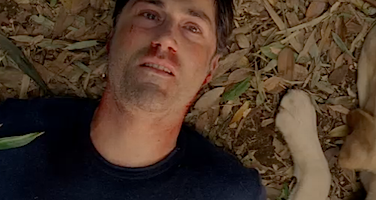
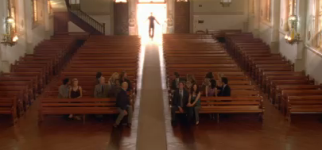
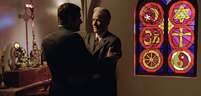

Ha terminado Perdidos.

Internet hierve con opiniones múltiples que se reducen a dos posibles:

*   a) El final es el perfecto, porque se centra en los personajes, y la serie iba de eso.
*   b) El final es un timo, porque la serie es sobre los misterios y no los resuelve.

Lógicamente, comprenderéis que estoy completamente de acuerdo con la primera opción. Los misterios son un añadido. La isla entera es el _McGuffin_ que ha servido de excusa durante seis temporadas para contar las relaciones personales de los protagonistas. El viaje de la razón a la fe de _Jack_, la traición de _Michael_, la evolución de _Sawyer_ hasta comprometerse con _Juliet_, las indecisiones de _Kate_, la pérdida del poder de _Ben_, las dudas y la culpa de _Locke_. Seis años de construcción a base de pequeños matices que hacen que los comportamientos de todos ellos tengan perfecto sentido.

En general, el centro del argumento ha sido la soledad y el aislamiento. Los personajes atrapados y perseguidos. En su vida, en una jaula, en otra jaula, en una cueva, en una isla. Personajes con una vida en la que estaban perdidos, sin un sentido, quizá un guiño desde el propio título de la serie, que no indica que se hayan perdido en una isla, sino en la vida. Y, siguiendo uno de los lemas de la serie, _vivir juntos, morir solos_, los personajes han dejado de estar perdidos para encontrarse, para crear lazos entre ellos dejando atrás todo lo previo, y ser capaces de avanzar juntos.

**¿Ha merecido la pena?** Sin duda. Esta serie redefine la forma de entender el entretenimiento televisivo (aunque dudo que su esquema se repita a corto plazo) y marca el imaginario colectivo. Ahora las comparaciones son "_es como en Perdidos_". Eso muestra que el viaje ha merecido la pena, incluso en los momentos en los que no iba en dirección alguna (que los ha habido).

**¿Y los misterios?** Como digo, son el _McGuffin_. La estatua, los otros, la cueva, el humo negro, los números, la lucha entre el bien y el mal. No es necesario añadirles una explicación para que todo lo que he mencionado anteriormente tenga sentido, y tenga planteamiento, nudo y desenlace. Incluso con todos los experimentos narrativos, con _flashbacks_ y _flashforwards_ y una realidad alternativa que es y no es alternativa, incluso con todo eso, hay un principio y un final claros de la historia, cerrando el círculo con el ojo de _Jack_, en el mismo lugar donde empezamos.

_Jack_ y _Kate_, _Locke_, _Sayid_ y _Shannon_, _Rose_ y _Bernard_, _Charlie_ y _Claire_, _Jin_ y _Sun_, _Boone_, _Juliet_ y _Sawyer_, _Desmond_ y _Penny_, _Hugo_ y _Libby_. Y _Christian_ abriendo las puertas. ¿Tiene sentido que sean estos personajes y no otros? ¿Están todos los que son o son todos los que están? No importa, ya que al final todos están juntos, en el templo en el que conviven todas las religiones, indicando quizá que todas las posibles interpretaciones son igual de válidas.

Qué duda cabe que yo tengo mi propia interpretación sobre todos esos posibles misterios, pero eso queda para otro post y otro día. Hoy no toca. Creo que quienes esperaban que hoy se explicaran otras cosas en el episodio final no tienen del todo claro cómo funciona la televisión.

**Sobre la emisión**: Un último episodio doble emitido con torpeza, incompetencia y falta de profesionalidad por parte de Cuatro en España, intentando hacer algo para lo que no están capacitados. Con subtítulos mal escritos, desacompasados, en ocasiones repetidos en la escena que no correspondía, con frases más largas de lo que permitía el ancho de pantalla... y emitiendo alrededor de diez minutos menos que se han saltado por arte de magia. Han explicado la razón por la que no merece la pena ver televisión a través de la televisión. Han continuado con lo que ellos llaman un debate sobre el final y yo llamo cuatro frikis incapaces de articular polisílabos mostrando su desconocimiento manifiesto sobre la narrativa televisiva. Entre esto y Manolo Lama os va a costar que vuelva a ver programas vuestros.