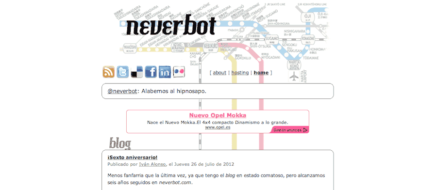
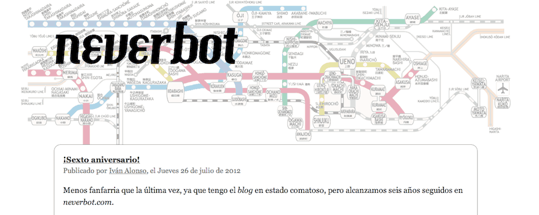

Ya tocaba. Estéticamente debería mantener un aspecto muy similar a la antigua versión, aunque adecuando los tamaños de letra y los anchos de página a los estándares actuales. Tengamos en cuenta que el diseño original ha permanecido inalterado durante los últimos seis años, y las costumbres evolucionan.

El solitario y cabizbajo anuncio que quiere hacerme millonario y se entristece asumiendo que no cumplirá su finalidad en esta vida ha perdido protagonismo, y ahora aparece después del primer _post_. Desaparecen los iconos de redes sociales, aunque ahora se mantendrá siempre una descripción textual (con enlaces) en el pie de página. Desaparece también el último tweet de la cuenta [@neverbot](http://twitter.com/neverbot), para no confundir, porque apenas quedaba claro de dónde salía esa línea. En general todo queda algo más legible.

Lo que muchos verán como una nimiedad, el cambio de Verdana a Georgia, es el cambio más sorprendente. Una fuente con serifa, quién lo iba a decir. Mi escurridiza memoria trata de recordarme que ya hice alguna prueba de concepto con Georgia cuando diseñé originalmente la web, pero no sé si creérmelo. Esto os da igual a casi todos, pero algunos transtornados le damos importancia a estas cosas.

Y así queda. Si estás leyendo esto desde algún tipo de agregador, pásate por la página original, [www.neverbot.com](http://localhost:8000/), a ver qué te parece. Ahora todo debería ser mucho más estándar, con html y css simple. Antes todo era mucho más... ¿primario? He cambiado cosas que hoy día son obviedades del desarrollo web, pero que en su momento hice como sabía. Y merezco un aplauso por haber sido capaz de encontrar un mapa del metro de Tokyo con el mismo diseño que el original, para rehacer la cabecera.

Si queréis, dejadme un comentarioJAJAJAJ. **No**. Ya no hay. 2.500 comentarios después, me queda demostrado que es un sistema que sólo sirve para dar problemas al _blogger_. A pie de página están todas las formas de contacto (_twitter_, _facebook_, _email_, etc) por las que podéis hacerme llegar cualquier pensamiento que tengáis a bien compartir.