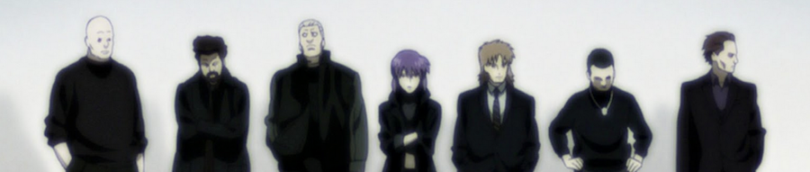

_Ghost in the Shell_ es quizá la más conocida de las obras del japonés _Masamune Shirow_, creada originalmente en forma de tebeo allá por 1989, lo que viene a ser la prehistoria de los paradigmas del entretenimiento capitalista moderno, y tuvo al menos dos continuaciones en papel, con los subtítulos _Man-machine interface_ y _Human-error processor_. Soy sincero si admito que su lectura no me pareció fácil en su momento, pero era joven y estúpido, y cualquier cosa levemente compleja habría planteado dificultades. La juventud (sobre todo) y la ignorancia (a veces) se curan con el tiempo, y quizás ahora les dé una relectura y descubra cosas nuevas. Recuerdo haber escrito [un artículo](http://www.cyberdark.net/portada.php?edi=6&cod=126) para el ya extinto portal de literatura fantástica _cyberdark.net_ acerca de las obras de este autor... pero miedo me da leerlo a estas alturas. Yo [lo enlazo](http://www.cyberdark.net/portada.php?edi=6&cod=126) y cada uno que decida lo que crea conveniente.

_Boma, Ishikawa, Batou, Motoko Kusanagi, Togusa, Saito y Paz, los protagonistas de Ghost in the Shell_

Como mandan los cánones, _Ghost in the Shell_ ha tenido adaptaciones al cine (de animación) en forma de dos grandes películas escritas y dirigidas por el especialista en ciencia ficción _[Mamoru Oshii](http://www.imdb.com/name/nm0651900/) --_ No sé si he quedado lo suficientemente esnob sacando a la palestra a un director japonés de género fantástico, pero mientras dudáis me atreveré a recomendar [_Avalon_](http://www.imdb.com/title/tt0267287/), otra obra suya mezcla bizarra de imagen real y _cgi --_. Como punto de acercamiento, podéis aprovechar que en 2008 se remasterizó la primera película y se rehicieron todos sus efectos computerizados, en lo que se tituló _Ghost in the Shell 2.0_.

En paralelo, ya basadas en argumentos originales, se crearon las dos temporadas de serie de animación realizadas por [_Production I.G._](http://en.wikipedia.org/wiki/Production_I.G.), auténticos especialistas en su campo, con el título de _Ghost in The Shell: Stand Alone Complex_. Nuevamente con un argumento de _Oshii_, es aquí donde el metraje proporciona tiempo suficiente para desarrollar tramas más adecuadas a los conceptos abstractos que componen el trasfondo de esta franquicia multimedia.

Aquí _Ghost in the Shell_ se muestra en toda su grandeza como la espléndida mezcla de género negro y ciencia ficción hard que es, en una sociedad cuyo desarrollo tecnológico bordea por fin el punto de la singularidad. Dos temporadas que engloban los casos de "_El hombre que ríe_" y "_Los 11 individuales_", además de capítulos aislados, intercalados entre las tramas, que exploran facetas concretas del presente y pasado de los distintos personajes. He tenido la oportunidad de darles un revisionado durante las últimas semanas y no deberían faltar en la videoteca de cualquier aficionado a la ciencia-ficción.

Ambas temporadas han sido adaptadas de forma resumida a dos _OVAs_/películas (que no recuerdo haber visto en España), y existe una tercera titulada _Solid State Society_ de la que he perdido las esperanzas de que llegue a nuestras tierras, y debe ser obtenida por otras fuentes.

Mientras esperamos el siguiente paso en el desarrollo de esta franquicia, podemos entretenernos con entradas de la wikipedia, como esta sobre la [filosofía detrás de _Ghost in the Shell_](http://en.wikipedia.org/wiki/Philosophy_of_Ghost_in_the_Shell), o podemos rezar para que no llegue a realizarse una película de imagen real, cuyos derechos tiene _Dreamworks_ desde 2008.