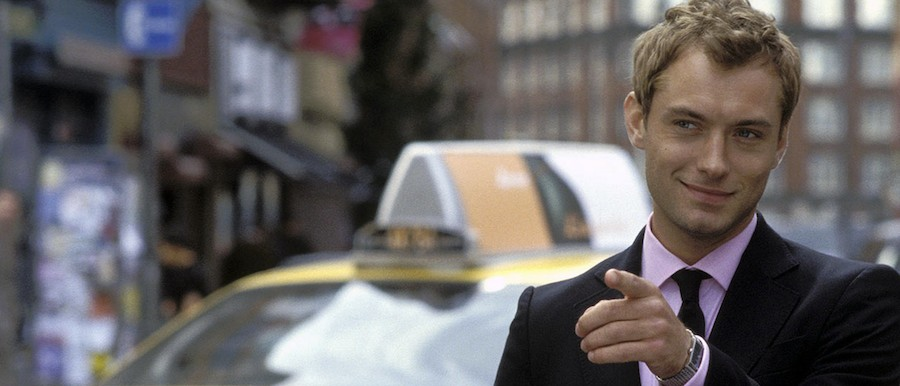
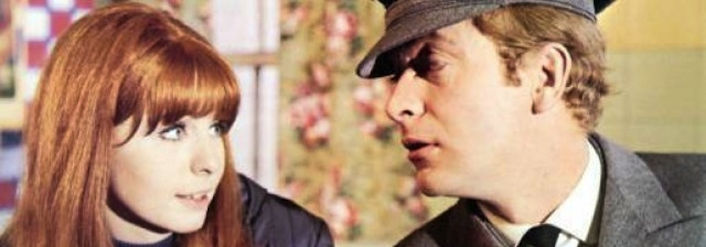

He tenido a lo largo de los años curiosas conversaciones sobre la que no debiera ser más que una obra menor, olvidable y fácilmente digerible, que es la moderna versión de _Alfie_ de _Jude Law_. Sin embargo se ha transformado en mi propia e intransferible mitomanía en uno de los clásicos modernos del cine romántico, capaz como ella sola de explicar todo lo importante de la vida y nada a la vez.

Dentro de su neutro costumbrismo, no tiene sentido pensar en ninguna secuencia de presentación, nudo y desenlace, ni cabe razonar quizá si tiene un buen final o un mal final. Sólo ha sido otro año más para _Alfie_. Quizá sólo con ese pensamiento se puedan explicar todos los misterios de la existencia.

_El [Alfie](http://www.imdb.com/title/tt0375173/) de Jude Law (2004)_

He recordado esta película, sin embargo, no por la obra en sí, sino por su versión original para cines, de 1966, protagonizada por un _Michael Caine_ en sus buenos viejos tiempos. Ha envejecido mucho mejor de lo que esperaba en sus apartados técnicos, con los mismos guiños y peculiaridades que tiene su versión moderna, sus rupturas de la cuarta pared, y sus encantadores títulos de crédito finales.

Es en lo argumental donde choca. Pese a ser una traslación bastante fiel de la película desde 1966 hasta 2004, la evolución de la moral social y de los usos y costumbres habituales hacen que diferencias en principio sutiles se antojen como mucho más importantes, construyendo un personaje completamente diferente. Quizá imposible de ver hoy como el amable granuja que interpreta _Jude Law_, _Caine_ se muestra como un tipo incluso desagradable rigiéndonos por los cánones actuales de comportamiento. Se jugaba hace ya más de cuarenta años en pantalla de una forma mucho más descarnada con los conceptos del aborto, el abandono de la prole, la infidelidad y hasta la violencia de género, todo ello desaparecido en la moderna versión, donde sin embargo no extraña ver algún que otro pechote y escenas de cama. Pasamos por el destape en el cine pero si se quiere hacer caja ya no se puede hablar de nada turbio.

_El [Alfie](http://www.imdb.com/title/tt0060086/) de Michael Caine (1966)_

Sorprendente ha sido también el distinto comienzo de la película, que sugiere incluso una nueva interpretación de los personajes de _Marisa Tomei_ y el pequeño _Max_ en su versión moderna. Quede quizá como guiño para quien quiera revisitar alguna de las dos películas, y pueda encontrar algo nuevo.