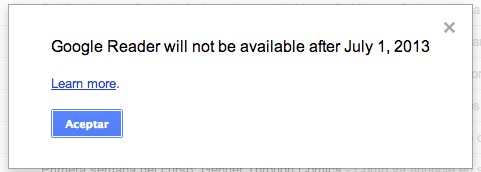

Hoy, en _Razones para no usar productos de Google_: [el sexto](http://www.slate.com/articles/technology/map_of_the_week/2013/03/google_reader_joins_graveyard_of_dead_google_products.html) proyecto de _Google_ que utilizo que cierran.

Esto hace mucho que se sabe, pero el aviso dentro del propio _Google Reader_ no lo había visto hasta hoy. A veces la dinámica de las propias empresas (como entes que toman decisiones, si es que es posible entender así el mundo), me sigue sorprendiendo. Todavía esperaba que lo reconsiderasen.

PD: Nótese que este post está escrito desde _Chrome_, y está rodeado de un par de anuncios de _AdSense_.