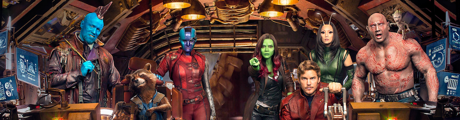
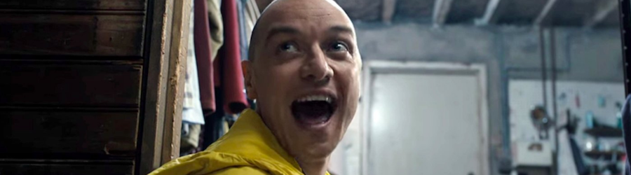
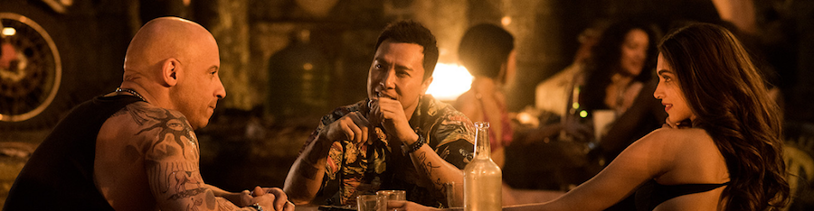

**[Guardians of the Galaxy, Vol. 2](http://www.imdb.com/title/tt3896198/)** (_James Gunn_, 2017)

Leía hace tiempo una anécdota en los internets (dónde si no) acerca de un padre y un hijo que iban a ver al cine alguna de las películas de _El Hobbit_. El hijo le decía algo así como que vaya pérdida de tiempo ver otra más, a lo que el padre respondía que por muy mala que fuese la película, cualquier minuto pasado en la _Tierra Media_ era un minuto disfrutado.

Crecí leyendo tebeos de _Marvel_. Nadie me va a convencer de que una, cuatro o quince películas al año de tíos en pijama saltando de un lado a otro pegándose, haciendo ruiditos y con muchos colorines y chistes es algo que no mola. Al fin y al cabo contentan a mi niño interior, que en el camino de vuelta a casa siempre me recuerda con su pequeña vocecilla que cuando éramos niños no había estas cosas. Ojalá las hubiese habido. Tampoco voy a negar que esto cada vez es más formulaico, que se le empieza a notar, y que no me extrañaría que cansara a cualquiera.

Ya a la primera película se le notaba por todas partes que intentaban colarte una nostalgia con retrocontinuidad mediante el método de ponerte un embudo en la boca y que te lo tragues todo (Hola, [Stranger Things](http://www.imdb.com/title/tt4574334/), ¿qué tal? Sí, también estoy pensando en ti). Mediante música ochentera, colores ochenteros, chistes ochenteros y ritmo de película ochentera para que disfrutes de una peli basada en un tebeo que jamás leíste en los ochenta.

Así que... sí, es peor que la primera. No es una película de los Guardianes, sino de [Chris Pratt](http://www.imdb.com/name/nm0695435/)/Starlord, en la que ningún otro personaje hace nada relevante para el argumento durante todo el metraje. Tiene algunas decisiones argumentales cuestionables. Tiene un villano que no encaja con el tono y el "tamaño" de las cosas que deberían estar pasando, y todos esos pequeños detalles que sólo los lectores de tebeos percibimos y que realmente dan igual, pero a nosotros nos hacen arquear una ceja. Y... pues vaya, ¿Qué más quieres que te diga?, que en general es peor.

Pero naves espaciales, chistes, pium pium, piñao piñao, muchos colores y ganan los buenos. Seguiré pagando por más películas de estas. Si los demás no vais al cine lo comprenderé.

PD: Colorines y chistes, DC, colorines y chistes. Te lo tengo dicho.

****

**[Split](http://www.imdb.com/title/tt4972582/)** (_M. Night Shyamalan_, 2016)

_\*Grumpf\*_. Siendo firme defensor como soy de prácticamente todas las películas de [Shyamalan](http://www.imdb.com/name/nm0796117/), esta se me ha hecho bola. Como siempre, he disfrutado de todo el metraje desde un punto de vista técnico, con unos planos opresivos que generan una magnífica atmósfera durante toda la película, con un ritmo lento pero constante como en todas sus obras previas, pero... _meh_.

Al terminar me queda la sensación de que no me han contado nada, y aunque la interpretación de [McAvoy](http://www.imdb.com/name/nm0564215/) de sus múltiples personalidades es correcta, tenía espacio para brillar y no lo ha hecho. Como al niño que aún siendo de los mejores de la clase no se le pone el sobresaliente porque lo podía haber hecho mejor, la película es disfrutable aún sin triunfar del todo.

**[xXx: The Return of Xander Cage](http://www.imdb.com/title/tt1293847/)** (_D.J. Caruso_, 2017)

Esto no debería existir. La acción es mala, los personajes secundarios insustanciales y Vin Diesel está fondón ya para estas cosas, y es que se le nota entre las costuras que es una película creada por comité para contentar a un tipo de público sin entender a ese tipo de público.

Si lo más entretenido de la película ha sido decir "_Anda, el tío que salía en Rogue One_" y el cameo de [Neymar Jr](http://www.imdb.com/name/nm4827772/), ya está todo dicho.