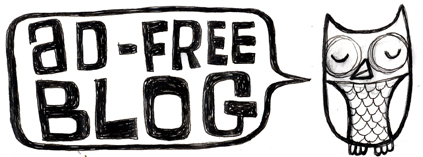

Rebuscando entre los entresijos más vintage de este y otros blogs, encontré una imagen que casi ni recordaba, pero que despertó en algún lugar profundo de mi cerebro una nostalgia por tiempos electrónicos mejores:

Wow. A blast from the past.

El sitio original es [adfreeblog.org](http://www.adfreeblog.org), pero parece caído indefinidamente. He encontrado [una copia en la Wayback Machine](http://web.archive.org/web/20051124162142/http://www.adfreeblog.org/) de hace más años de los que debería. Sus creadores fueron [Keri Smith](https://kerismith.squarespace.com/) y Jeff Pitcher (de quien no he encontrado nada actual).

Encontré algunas cosas más actuales de Keri Smith buscando en internet, como [una cuenta de Instagram](https://www.instagram.com/explorationoftheday/) prácticamente abandonada y [un blog](https://kerismith.squarespace.com/blog) con una única entrada de 2019, titulada "[Coming out of my silence](https://kerismith.squarespace.com/blog/Blog%20Post%20Title%20One-gl642)", que es bastante iluminadora.

> Because of “Ad Free Blog” I was attacked online and in advertising  magazines, and later trolled nearly constantly. I began to see the tone of the internet slowly changing from a place of camaraderie and  creativity, into a space of vitriol and anonymous attacks.
