> Este artículo fue publicado tiempo antes de que tuviera un blog, durante el pretérito año 2003, en el ya extinto portal sobre literatura de género [cYbErDaRk.net](http://www.cyberdark.net/portada.php?edi=6&cod=126). Lo he recuperado para dejarlo aquí y que no se pierda, con su fecha original.
>
> El texto no ha sido retocado, pero he cambiado las imágenes incluidas por otras en mayor calidad cuando ha sido posible (era el 2003, tengámoslo en cuenta).

---

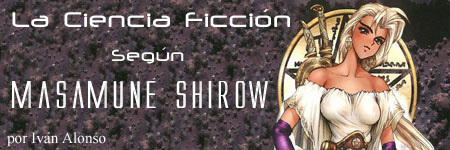{.center}

Parecía obligado, en una página como ésta, dedicada en gran parte a la ciencia-ficción entre otros géneros más o menos fantásticos, que se dedicaran algunas líneas a otras formas de entender la ci-fi más allá de los libros. En ocasiones se escriben (y, más importante aún, se leen, a ver si yo consigo el mismo efecto) algunos artículos o críticas sobre películas del género, pero existe un medio que, por lo general, no suele salir de sus entornos propios para intentar extenderse hacia nuevos potenciales lectores. Naturalmente, me estoy refiriendo al cómic.

Muchas veces hemos oído como la literatura fantástica debería intentar salir de ese 'ghetto' en el que se encuentra sumida, intentando llegar a nuevos lectores y abrir nuevos mercados, alejándose un poco de la situación más común: la ciencia-ficción únicamente es leída por el lector de ciencia-ficción. Entendámonos, lo que quiero decir es que el lector despistado que busca por una gran superficie algo para leer antes de dormir nunca (o casi nunca) se detendrá ante la estantería de ci-fi (triste tener todos los libros apartados de los demás, no vaya a ser que los contaminen), donde únicamente buscarán los clientes habituales del género.

¿Y a que viene este discurso gratuito y espontáneo sobre el mercado? A explicar que nosotros mismos en muchas ocasiones somos quienes tiramos piedras sobre nuestro propio tejado. Todos conocemos a lectores de 'sesudos' libros de ciencia-ficción que reniegan de leer un cómic, incluso aunque el género a tratar pueda ser el mismo. A ver si con algún pequeño esfuerzo como este conseguimos que alguien más se atreva a leer un tebeo por una vez en su vida.

Y qué mejor opción a la hora de llevar a cabo este plan de dominación mundial que Masamune Shirow. Autor consagrado internacionalmente, con obras fáciles de conseguir, publicadas en español y con un nuevo volumen en el mercado desde no hace mucho.

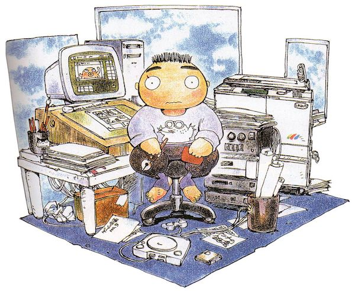{.center width=60%}

*Caricatura del propio Shirow*.{.center}

Masamune Shirow es el pseudónimo de un japonés nacido en 1961 en Kobe, del que no existen fotografías y de cuya vida personal poco o nada se conoce, dado que no realiza apariciones públicas, no asiste a convenciones y realiza pocas entrevistas con los medios. En cuanto a su vida laboral, cabría señalar sus estudios de arte en la Universidad de Osaka y su relativamente breve etapa como profesor de instituto antes de abandonarlo definitivamente para dedicarse a sus mangas (palabra utilizada para referirse al cómic de origen japonés, que intentaré no utilizar demasiado para no liar al hipotético lector del artículo). Es importante el hecho de ser un autor algo atípico dentro del propio mercado japonés e internacional. Trabaja sin ayudantes, algo muy poco usual en su país, más aún teniendo en cuenta su nivel de detalle en determinadas escenas y fondos, que por lo general suelen encargase a colaboradores. Desde su inicio como profesional gozó de una posición inusual como dibujante, sin estar sometido a las presiones editoriales habituales y dibujando (y publicando) a un ritmo marcado por su propio trabajo. Es, además, un autor bastante "occidental" si se me permite utilizar ese adjetivo, en el sentido de que sus obras son bastante adaptables al mercado europeo y americano. Su dibujo es bastante más realista que el que podríamos encontrar en muchos otros mangas, y podemos aproximarlo al estándar que el lector medio occidental necesita para acostumbrase con facilidad a las nuevas lecturas. Breve biografía personal para tan gran autor, pero quien necesite más datos podrá encontrarlos fácilmente en multitud de páginas Web dedicadas íntegramente al autor por todo Internet.

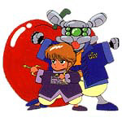{.center}

*Caricatura de los personajes de Appleseed*.{.center}

En cuanto a su obra (que es lo que debería interesarnos), ya de joven mostraba un talento que muchos profesionales hubiesen envidiado. No era el lector habitual de cómics en Japón por aquella época, y aquí conviene hacer una aclaración para los no iniciados en el género. En el país del sol naciente, la diferencia entre 'géneros' no se realiza del mismo modo que en occidente, donde diferenciamos según el origen de la obra (americana, europea, oriental, etc.) o la temática (ciencia-ficción, superhéroes, humor, etc.) sino que existe una diferencia bastante más obvia que poco o nada se ha tenido en cuenta históricamente en nuestro civilizado mundo occidental: la diferencia según el público al que está destinada la obra. De este modo, y limitando a las dos más obvias para no extendernos en demasía, principalmente enfocados hacia un público joven, tendríamos el Shonen (destinado a chicos) y el Shojo (destinado a chicas). El primero tendría notas más aventureras, quizá deportivas, centrado sobretodo en la superación personal en diferentes ámbitos, y el segundo estaría mucho más orientado a la interacción social, los amoríos adolescentes, las amistades y un largo etcétera. Naturalmente la frontera entre ambos géneros es en ocasiones muy difícil de precisar.

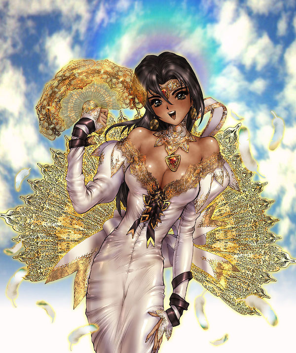{.right width=50%}

Siguiendo por donde íbamos antes de este inciso, Shirow no era el lector típico de Shonen, sino que sus lecturas más habituales iban dirigidas hacia el Shojo, que por aquella época mostraba una evolución artística mucho mayor, con historias innovadoras y maquetaciones de páginas mucho más originales. Probablemente esa influencia sea la que ha hecho que los protagonistas de las historias de Shirow sean, en su mayor parte, por no decir siempre, mujeres (el propio Shirow se justifica diciendo que así no se ve obligado a incluir inútiles tramas románticas dentro de la trama global para contentar a todo su público).

Su primera obra, Black Magic, que realizó contando con tan sólo 21 años, llamó la atención de Harumichi Auki, presidente de Seishinsha (importante editorial de cómics dentro de Japón), pese a que fue realizada para un fanzine (publicación amateur o de aficionados, con mayor o menor calidad editorial). A partir de ahí, su carrera como profesional se disparó. Esta primera obra nos acerca a un mundo pasado, donde el sistema solar estaba dominado por otra cultura procedente de Venus. Pese a ser gráficamente de un nivel mucho menor al de sus obras profesionales (tengamos en cuenta el origen y publicación como aficionado de esta publicación), ya presenta sus habituales temas: ciencia-ficción mezclada con algunos toques de mitología y elementos fantásticos, inteligencia artificial, biotecnología y un largo etcétera. Posteriormente sería llevada al cine en forma de película de animación con el título de Black Magic M-66, al igual que harían posteriormente sus obras más maduras, Appleseed y Ghost in the Shell.

Su segunda obra, ya dentro del mercado profesional, es Appleseed. Teóricamente inacabada, el autor tenía en mente una serie de 10 tomos, aunque únicamente se han realizado cuatro completos y un par de capítulos del quinto (todos ellos publicados en España), dado que la revista donde se publicaba la obra originalmente dejó de editarse. Esto, que podría espantar al más pintado, en la práctica no plantea problema alguno, dado que los cuatro tomos presentan una historia completamente autoconclusiva. Al igual que Ghost in the Shell (ambas podrían considerarse sus obras más importantes), el funcionamiento del cómic se plantea originalmente de un modo bastante simple: se nos presentan a una serie de personajes en un mundo ficticio. Estos viven una serie de capítulos aparentemente inconexos para, al acercarse al final de la serie, descubrir que pequeños detalles dispersos por toda la obra se unen para formar todas las pistas de una trama escondida que nos plantea serias dudas sobre toda la obra. Citando a Brad Pitt: 'la película sigue y el espectador no se ha enterado de nada'.

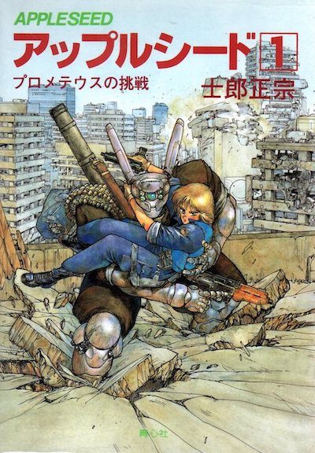{.center}

*Portada del primer Appleseed*.{.center}

Llega el momento de ponerse serios (y críticos, que esto no es un artículo de alabanza sobre las obras). Shirow es un gran autor de ciencia ficción, de los mejores. Como dibujante su mano no tiene precio, y a su muerte su espíritu irá a un cielo especial reservado únicamente a los más grandes. Pero como narrador de la historia que pretende contar es muy confuso. Realmente confuso. Shirow gusta de llenar sus historias con textos de apoyo explicando hasta lo más nimio y falto de relación con la trama, desde el funcionamiento de un androide hasta el método de manufacturación de un material, pasando por una explicación de alguna maniobra táctica utilizada por tropas militares en el mundo real o una recomendación sobre un libro de inteligencia artificial que haya leído recientemente. Esto nos plantea serios problemas de continuidad en lo que a nuestra atención se refiere, e incluso el propio autor recomienda hacer lecturas separadas para el cómic y los textos de apoyo. A esta confusión general (aunque solventable si se tiene paciencia), hay que añadir una manía muy mala de ciertos autores a presuponer que el lector está familiarizado con un mundo nuevo salido únicamente de su imaginación.

Pondré un ejemplo aproximado: imaginemos que Julio Verne hubiera escrito una novela sobre piratas informáticos (le hubiera hecho falta mucha imaginación, lo sé). Y que además hubiera llenado su novela con términos técnicos como direcciones IPs, hosts, protocolos, firewalls, satélites, y un largo etcétera. Naturalmente a los lectores contemporáneos les hubiera parecido una tomadura de pelo. Este vicio de Shirow nos vuelve locos cuando nos habla de una persecución a un pirata en el ciberespacio utilizando términos que serán técnicos (quizá) en un futuro, pero que en el tiempo real aún no existen. Esto hace peligrar la continuidad en otros temas más fantásticos alejados de la ciencia-ficción, como puede ser su obra Orion, ya que en los demás esta ingente cantidad de términos al menos se 'aproximan' a los actuales en el mundo real. Como justificación, siempre me digo que Japón es un lugar lejano, muy lejano. Y que las distancias en este mundo no son únicamente geográficas, sino también culturales (y ojalá eso no cambie nunca). Pertenecen a un mundo donde las cosas, los objetivos en la vida y el día a día son muy distintos a los que nosotros podemos adoptar, y eso tiene que verse reflejado en todas sus formas de arte, incluidos los cómics. Eso me ayuda a querer hacer un esfuerzo por intentar entender aquellas partes que se me hacen más difíciles. Eso y una frase que dijo una vez un gran pensador: "los japoneses es que cuando hablan de filosofía se explican muy mal".

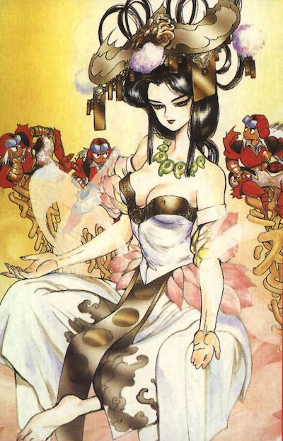{.center}

*Ilustración para Orion*.{.center}

Es por esto que, pese a su publicación actual en tomos en España, me permitiría recomendar una lectura mucho más pausada (capítulo a capítulo) con varias pasadas si hay algo que ha quedado colgando. El preciosismo del dibujo y la profundidad del argumento se prestan a este tipo de lecturas por lo que, además de conseguir entender el argumento, averiguaremos que está repleto de detalles realmente interesantes.

Y convendría revelar algunos de estos detalles sobre sus famosos argumentos, pero intentando alejarme de los comentarios habituales que pueden encontrarse en Internet (la mayor parte de los aficionados únicamente te destripan todo el contenido de la obra cuando únicamente pretendes leer una sinopsis). Siendo Appleseed y Ghost in the Shell sus dos obras más conocidas internacionalmente, así como las de mayor extensión, son el mejor caso de estudio para nuestro artículo. Hablando de la primera, Appleseed, cabría señalar que en Japón fue premiada en 1985 con el Seiun-Sho al mejor cómic de ciencia-ficción, premio que podríamos aproximar al Hugo norteamericano. Su argumento, en el origen, no parece plantear excesivas novedades: Deunan y Briareos (mujer y cyborg, respectivamente, ambos expolicías), sobreviven en un mundo postapocalíptico tras una guerra mundial que ha asolado el planeta hasta que son localizados por Hitomi, trabajadora de la Arcología de Olimpo (una arcología vendría a ser una nueva forma de diseñar una ciudad), una moderna ciudad-estado construida tras la guerra mundial donde se pretende no cometer los mismos errores pasados. Dada su experiencia, entran a formar parte de las nuevas tropas especiales de la policía dentro de la ciudad, viéndose inmersos en peligrosas tramas políticas. Todo se complica cuando se descubre que una gran parte de los habitantes son bioroides (algo que podríamos aproximar como clones), prácticamente idénticos a personas pero no iguales. Extraños planes para averiguar lo que convierte a una persona en lo que es, intentos de buscar el destino del ser humano, todo ello mezclado con tramas policiales en un mundo realmente bien construido hace de esta obra algo realmente recomendable.

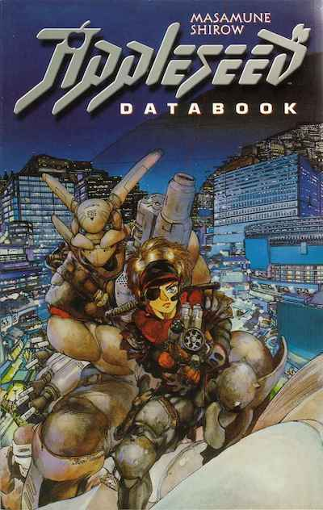{.center}

*Portada cuerto número de Appleseed*.{.center}

No se aleja del todo su otra gran obra, Ghost in the Shell, y es que el tema del destino del ser humano parece ser recurrente en el manga y el cine de animación japoneses. Ghost in the Shell, originalmente publicada en España como Patrulla Especial Ghost (y posteriormente en un único tomo con su título original), es una obra al más puro estilo Cyberpunk, presentándonos un universo de alta tecnología, donde humanos con implantes cibernéticos y androides con inteligencia artificial son el día a día. Nuevamente otro personaje femenino (la Mayor Kusanagi) y nuevamente toques policíacos (una patrulla especial de delitos informáticos) marcan el ritmo de la obra. Mega corporaciones, espías rusos, los siempre presentes robots de Shirow (magistralmente creados en todas sus obras, a un nivel de detalle asombroso), y decenas de detalles de alta-tecnología pasan ante nosotros hasta llegar a los capítulos finales. Una inteligencia artificial que dice haber alcanzado realmente un nivel superior al del ser humano (todas las IAs están limitadas) es encontrado. Repetimos algunas de las ideas de la obra anterior, aunque tratadas desde otros puntos de vista: el destino del hombre y de la humanidad, la existencia del alma (el "ghost") y el siguiente paso a tomar. Igualmente estoy en la obligación de recomendarla a todo aquel que la tenga a mano.

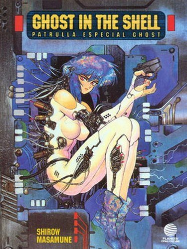{.center}

*Portada Ghost In The Shell de Planeta DeAgostini*.{.center}

Esta obra fue continuada años después en otro tomo titulado Man-Machine Interface (de reciente publicación en España), aunque también es comúnmente conocida como Ghost in the Shell II. Aquí es obligatorio decir que el virtuosismo gráfico alcanzado como dibujante es difícil de superar por cualquier artista actual a nivel mundial. Realmente soberbio. Pero también es en esta obra cuando alcanza, como narrador, uno de sus puntos más confusos. Pese a ser una continuación, el lapso de tiempo transcurrido entre ambas ambientaciones los convierten en dos obras prácticamente independientes. En la segunda, el mundo ha evolucionado aún más sus niveles tecnológicos, encontrándonos personajes cuyo "ghost" puede viajar de un cuerpo a otro, alojarse en el ciberespacio, o manejar varios cuerpos simultáneamente. La mayor parte de la obra transcurre en ese espacio cibernético e irreal, realizándose continuas persecuciones y viajes a través de él. Si a esto le sumamos lo ya comentado sobre el lenguaje técnico inventado, tenemos una obra maravillosa de observar pero prácticamente imposible de leer para el lector occidental. Se nos presentan a quienes podrían ser los 'herederos' de aquella Inteligencia Artificial presentada en el anterior tomo, y como se realiza una especie de 'plan' de complementación de personalidades, donde diferentes almas o "ghosts" se funden para intentar obtener ese hipotético siguiente paso evolutivo. Es probable que nuevas relecturas me revelen pistas que han permanecido escondidas y cambie de opinión, pero este tomo únicamente se lo recomendaría a los fans del autor, ya acostumbrados a esta forma 'peculiar' de contar las cosas.

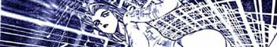{.center}

*Viñeta de ManMachine Interface -Ghost In The Shell II*.{.center}

Dado que este articulo deja de lado sus otras obras no de ciencia-ficción, hay ciertas cosas que debo dejar de lado. De todas formas, tengo que recomendar sus dos libros de ilustraciones, Intron Depot I y II (el segundo con el subtitulo Blades), existentes únicamente en japonés pero posibles de encontrar en España (aunque a elevado precio dado que son de importación) realmente magistrales tanto en presentación como en contenido.

Y, como final, también convendría mencionar otra obra de ciencia-ficción del autor: Dominion, aunque mucho más orientada hacia el humor pese a su ambientación futurista. Nuevamente una mujer (Leona Ozaki) perteneciente a un cuerpo policial (la Tank Police) es la protagonista de las aventuras, en este caso mucho más desenfadadas. Persecución de criminales a lo largo y ancho de la ciudad a bordo de tanques (provocando el consabido nivel de destrucción que implicaría el utilizar un cuerpo policial de este tipo). Personajes mucho mas cómicos y alejados del tono de ci-fi "hard" que Shirow proporciona a sus otras obras mas 'serias'. Estructurada en dos miniseries (Dominion: Tank Police y Dominion: Conflicto), es también bastante recomendable pero, dado que queda fuera de la finalidad original de este artículo, tendremos que dejarla para otro día.

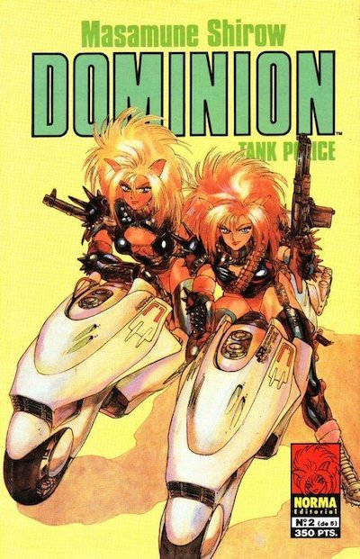{.center}

*Portada de Dominion: Tank Police*.{.center}

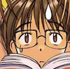{.left}

Iván Alonso (alias Folken) tiene 23 años y vive en Madrid. Estudia Ingeniería Informática, aunque prefiere pensar que es ingeniero y se dedica a trabajar de estudiante. No, no lleva gafas.

---

> La firma estaba incluída en los artículos de cYbErDaRk. Me ha hecho sacar una sonrisita.
