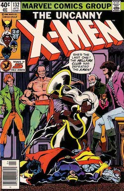
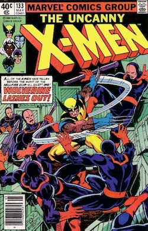

> Este artículo fue publicado tiempo antes de que tuviera un blog, durante el pretérito año 2003, en el ya extinto portal sobre literatura de género [cYbErDaRk.net](http://www.cyberdark.net/portada.php?edi=6&cod=159). Lo he recuperado para dejarlo aquí y que no se pierda, con su fecha original.
>
> El texto no ha sido retocado, pero he cambiado las imágenes incluidas por otras en mayor calidad cuando ha sido posible (era el 2003, tengámoslo en cuenta).

{.center}

Llevemos atrás nuestra memoria hasta el estreno de X-Men. Personalmente recuerdo que fui a verla con mucha expectación, y también que una cierta decepción me sobrevino al abandonar la sala. No había sido una película mala, vaya, pero había algo que no acababa de cuadrar. Los personajes habían sido sacados de contexto para poder meter a los que interesaban (principalmente aquellos cuyos poderes eran baratos de llevar a la pantalla), y muchas situaciones parecían forzados clichés, en un intento de querer contar más cosas de las que se pueden contar en una película de acción. Demasiados personajes cargados de demasiados años de historia en el tebeo para la duración del filme. Y aún así no era mala. Sólo había que evitar compararla con ciertas historias del cómic para no hacerla quedar en ridículo y obteníamos una película divertida y resultona que se dejaba ver muy bien.

El final no daba excesivo lugar a una continuación clara, a excepción de que los personajes continuaban todos vivos y Magneto era capturado. No había más pista o indicio, aparte de la gran recaudación, que indicara cómo podía ser la secuela. Tras X-Men, los defensores por excelencia de la gran manzana (Spider-Man y Daredevil) llegaron al celuloide, abriendo un nuevo mercado cinematográfico. Para unos meses más tarde, se veían a lo lejos el retorno de los Imposibles X-Men y el Increíble Hulk (La Masa para los más viejos del lugar).

Llega el momento y me arriesgo. Compro la entrada, voy al cine y me siento en un lugar bien centrado. Comienza la película y, tras las logoformas de Twentieth Century Fox y Marvel Entertainment Group, aparece el titulo de la película, un simple X2 que hace que un escalofrío me suba por la columna y se me erice el vello de los brazos (este friquismo mío no me va a llevar a ninguna parte en la vida). Tras casi dos horas de silencio (excepto para aclarar alguna pregunta del tipo ¿ese es malo? de los acompañantes), salgo del cine. Y aún durante más de una hora sigo en silencio, dándole vueltas a todos los detalles de la película. Y es que, por primera vez, todo casa, todo está en su lugar, y todo se corresponde con lo que esperaba de esos personajes, de MIS personajes. Bueno, seamos sinceros, casi todo. Pero al menos en esta ocasión ya hay que ser un auténtico entendido del Universo-X para saber captar las diferencias (pequeñas, pero existentes) que pueden llegar a chirriar.

Analicemos. La película es correcta, el guión es creíble (dentro de la fantasía de un tebeo, naturalmente), y la "suspensión de la incredulidad" es la mínima necesaria para creerte todo lo que te ponen en pantalla. Correcta la música, correcta la imagen, la fotografía, los personajes e incluso la interpretación de los actores (sigue siendo una película de acción y no es necesaria en exceso, pero no parecen hacerlo mal). Correcta significa simplemente que al salir de la película no piensas "que mal ha quedado (rellenar aquí con lo que sea)", sino que simplemente no te has estado fijando en esas cosas porque la historia fluye con la coherencia necesaria como para no permitírtelo. No creo que deba extenderme más en el plano cinematográfico, ya que ni es la función de este artículo ni es mi deseo convertirlo en eso.

Y ya que deberíamos desviar la conversación hacia la adaptación (y me estoy extendiendo en demasía en otros menesteres), voy a hablar de la historia. En esta película no hay un malo súper poderoso que lance rayos de lo que sea y, sin embargo, la maldad está presente. Se hace incluso necesario colaborar con el antiguo enemigo, Magneto, y las excusas no chirrían a la vista del giro argumental final. Descubrimos a Xavier como alguien realmente poderoso y nos acercamos más a la escuela para jóvenes talentos. Pero vayamos por orden que estoy mezclado cosas.

Nada más empezar, y enlazando perfectamente con el final de la primera película, vemos a Logan (Lobezno) en Alaska, tratando de encontrar pistas sobre un pasado confuso y una memoria perdida. Flashbacks de lo que podría ser el proyecto Arma-X en el que participó. Aunque fuera en Alberta, Canadá, y no en Alaska, Estados Unidos. Recordemos que Lobezno no es estadounidense, sino canadiense, algo que creo no se ha mencionado en las películas y debe dolerles a los busca-héroes cinematográficos yankees. De hecho, si consultamos la Web sobre la película, veremos que el clásico ‘Origen: Canadiense’ ha sido cambiado por un ‘Origen: Desconocido, posiblemente canadiense’. Tampoco se nos dan nombres, fechas, ni pistas mas allá de lo necesario; no aparece referencia alguna a Arma-X, al Departamento-H ni nada que se le aproxime. Probablemente sea lo mejor, ya que la historia de Lobezno es quizá la más compleja de entre todos los personajes Marvel. Pese a la edad que representa, no debe quedarle mucho para cumplir el siglo de vida (o más, quizá lo sepamos con exactitud al terminar la nueva serie Lobezno: Origen, ya en el mercado). Y la historia de una persona que ha sido desde agente secreto hasta soldado en la segunda guerra mundial, desde aprendiz de samurai hasta miembro de organizaciones inter-dimensionales, puede llegar a ser tan compleja que es mejor no liar demasiado la madeja y dejar para la película únicamente los detalles más importantes. Simplemente algún tipo de relación con Stryker, un coronel norteamericano reconvertido a científico, nos da pistas sobre su reinventado pasado.  

{.center}

*Primer número de la serie limitada que explica el origen del que quizá sea el más importante mutante de Marvel. Guión de Paul Jenkins y dibujo de Andy Kubert*.{.center}

Detalle importante: Lobezno aparece en escena fumando, y lo hará durante toda la película. Recordemos que es una película made in Hollywood, aparentemente juvenil, y que Lobezno es el protagonista. Es "el bueno", y fuma. Esto es más importante de lo que parece, una demostración que la película no se centra únicamente en ser el típico producto comercial sino que pasa a respetar a unos personajes que son como son y cuentan con una historia sobre sus espaldas. También convendría recordar que la propia editorial en ocasiones ha intentado maquillar este tipo de comportamientos en algunos de sus personajes como Lobezno, La Cosa (4 Fantásticos) o Nick Furia, grandes fumadores de habanos, con lo cual podríamos hablar de fidelidad por encima de la propia editorial.

Más adelante, en la magnífica secuencia de la invasión de la escuela de Xavier, veremos las impresionantes escenas del verdadero Lobezno. La imparable máquina de matar, el asesino implacable del tebeo aparece durante cinco minutos en los que se deshace de los soldados de las tropas especiales uno tras otro utilizando únicamente sus garras. La primera víctima es la más impactante, quedando ensartado contra la nevera de la cocina en una escena que se me ha quedado grabada. Este tipo de reacciones viscerales del personaje han sido tratadas de las más diversas formas según qué autores fueran los encargados de contar sus aventuras en cada momento, y solían ser dejadas como última vía de escape, pero sin conseguir evitar que los aficionados supiéramos cómo era el personaje en realidad.

{.center}

*Las aventuras de los "muties" mas jóvenes. Tras la desaparición de Los Nuevos Mutantes (que se convirtieron en X-Force), ocuparon su puesto. Algunos de los alumnos en la película han salido de estas páginas*.{.center}

También se nos premia a los aficionados con detalles de cierta relevancia. El grito sónico de Siryn que pone en problemas a ambos bandos, la huída de Kitty Pride atravesando personas y paredes, y un magnífico Coloso (Piotr -Peter- Nikolaievitch Rasputín, en el tebeo enamorado de la chica) que pese a contar con apenas un par de frases tiene una de las transformaciones más emocionantes de la película (mi reino por haber “ascendido” a este personaje a la "primera división"). Aunque parece que haya pasado de ser un ruso a ser un estudiante americano más, dado que ha perdido todo rastro de su acento, tan marcado al menos como el de Rondador Nocturno. Y no son los únicos jóvenes mutantes reconocibles. Los lectores de la ahora extinta Generación-X habrán entrevisto a muchos de los chicos que rondan por la escuela durante todas estas escenas. 

{.center}

*Lobezno y Magneto, enemigos irreconciliables*.{.center}

Más tarde asistimos a la huída de Magneto de su prisión de vidrio y plástico, al extraer de un guardián todo el hierro que ha sido inyectado en su sangre. Cantidad ínfima para un organismo vivo, pero suficiente para que el amo del magnetismo sea capaz de controlarlo. Es la prueba del poder que puede atesorar un mutante que lleva toda su vida ejercitándose. Es imposible no recordar el dramático momento de la extracción del adamantium a través de la piel de Lobezno (Los sueños se desvanecen, X-Men 25 USA, perteneciente a la saga Atracciones Fatales), de donde probablemente saliera la idea para esta escena.

Xavier y Cíclope son hechos prisioneros y se convierten en marionetas del malo de turno. Uno no puede evitar pensar que esto ya lo ha visto antes, y esa es precisamente la gracia de la película: que este tipo de situaciones sean reconocibles. La mente de Xavier es dominada por Jason Wingarde (Mente Maestra), personaje existente en el tebeo pero completamente tergiversado para la película. Pese a que en el tebeo tuvo un importante papel, dominando la mente de Fénix (Jean Grey) y obligándola a tomar el papel de Reina Negra en el club Fuego Infernal (¡Y su nombre es Fuego Infernal!, Uncanny X-Men 132 USA), aquí no es más que un esclavo del malo de turno que lo utiliza para llevar a cabo sus fines. 

{.center}

{.center}

*Dos de los números de la saga del Club Fuego Infernal, con el verdadero Jason Wingarde*.{.center}

Y es que, ¿quién es el malo? El coronel Stryker, supuestamente el padre de Jason. Así que ese podría ser un primer fallo argumental. Naturalmente, esto es perdonable al intentar mezclar distintos personajes y dotarlos de ciertos lazos familiares para tener que hacer las menores explicaciones posibles. Si en el par de horas que dura la película tuviésemos que respetar la historia de todos y cada uno de los personajes, habría que contar tantas cosas que sobrepasaríamos la capacidad de asimilación de cualquier ser humano medio (incluidos los propios aficionados).

Buceando entre los arcos argumentales de los X-Men encontramos la novela gráfica Dios ama, el hombre mata, donde aparece William Stryker, reverendo y ex-sargento del ejército norteamericano. Vemos que en la película no queda nada del reverendo, y ha sido ascendido a coronel. Por culpa de las radiaciones recibidas por él y su familia durante su época militar como investigador de tecnologías nucleares, su hijo nace con horribles mutaciones que lo atormentan y enloquecen hasta el punto de llegar a asesinar a ambos, eliminar las pruebas y terminar culpando de todo a los mutantes. Pocas similitudes han quedado con el personaje original, que ha pasado de ser un orador público, exaltador de la ola anti-mutante, a un militar perteneciente al proyecto Arma-X. Al menos para la película se inventan otro hijo para que la excusa del odio a los mutantes siga siendo la misma. Naturalmente, hacer que un predicador fuera el malo probablemente sea demasiado para ciertos públicos puritanos, y toda referencia a ese pasado ha sido ignorada.

No obstante podemos ver ciertos paralelismos con esa historia original. Magneto termina ayudando a la Patrulla para vencer al enemigo y el plan de Stryker es dominar mentalmente a Xavier para utilizar una tecnología de detección de mutantes y matarlos con un rayo psíquico. Aunque todo lo que ocurre entre medias no tienen mucho que ver, podríamos estar hablando de una adaptación muy libre de dicha novela gráfica. Si todo esto lo mezclamos con el proyecto Arma-X (aunque en realidad no tengan nada que ver), explicamos en la misma película otro pedazo del puzzle que compone el pasado de Lobezno y el espectador se queda tan contento, sin marearse ante la avalancha de nombres y datos que le sobrevendrían de otro modo. 

{.center}

*Dios ama, el hombre mata (1982), con guión de Chris Claremont y dibujo de Brent Anderson*.{.center}

Pequeños detalles que merece la pena recordar: en el bar en el que Mística "seduce" a uno de los guardianes de Magneto, quien está apareciendo en un debate televisado no es otro que Hank McCoy, alias la Bestia, miembro fundacional original de la primera Patrulla-X (a saber: Cíclope, la Chica Maravillosa -Jean Grey-, el Hombre de Hielo, el Ángel y la Bestia). Una pena que ni Ángel ni Bestia aparezcan en la película, y que el Hombre de Hielo (Bobby Drake) haya descendido de categoría. Años después, en la segunda génesis de los X-Men, se unieron al grupo (no exclusivamente) Tormenta, Coloso, Lobezno y Rondador Nocturno, con lo que el elenco de superhéroes de la película va tomando una forma más próxima a la de esta alineación.

Muy posterior sería la incorporación de Pícara que, desde luego, era muy diferente, con unos poderes más avanzados, más adulta y, por qué no decirlo, simpática y atractiva. También más adelante llegaría el personaje de Gámbito (Remy LeBeau), el eterno pretendiente de Pícara en el cómic, función que en el celuloide parece recaer sobre el Hombre de Hielo. Por mencionar a otro de los personajes que fugazmente aparecen en la película, tendríamos a otra de las incorporaciones más tardías, Júbilo, que ocupaba el puesto de niña que no controla sus poderes y proporciona los argumentos adolescentes. Podemos observar que esta Pícara fílmica viene a ser una mezcla de la verdadera Pícara y aquella joven Júbilo, al menos en cuanto a posición dentro del grupo y forma de actuar.

Y ya que hemos mencionado a Gámbito, recordemos el momento en el que Mística accede a los archivos secretos de Stryker y podemos ver por un instante una lista de mutantes clasificados, entre los que aparece el nombre de Remy LeBeau, Jamie Madrox y otros (habrá que esperar a la versión Dvd para que pueda fijarme con mayor detenimiento).

Precisamente en ese momento Mística se está haciendo pasar por el que puede ser el único enemigo "físico y tangible" al que se enfrenta Lobezno (y, por añadidura, la Patrulla-X) durante la película. Yuriko Oyama, Dama Mortal. Uno de los más perseverantes y carismáticos enemigos de Lobezno, que aquí está tan desaprovechada que da cierta pena. Originalmente, Yuriko era la hija de un científico japonés investigador del metal conocido como adamantium. Por extraño que parezca, no tenía nada que ver con los personajes mutantes, ya que fue creada como personaje secundario para Daredevil, mientras éste perseguía a Bullseye en Japón (Daredevil 197 USA). Más adelante fue aprovechada como enemigo para Lobezno, ya que ella creía que éste podía estar relacionado con las investigaciones de su padre. Tras trágicos sucesos familiares en aquellas aventuras de Daredevil, en los que tanto su padre como su marido perdieron la vida, su mentalidad cambió por completo y pasó a ser una despiadada asesina obcecada en terminar con la vida de Lobezno, a quien irracionalmente relacionaba con lo sucedido. Tomó el nombre de Dama Mortal y se enfrentó a Lobezno en varias ocasiones, primero dirigiendo un pequeño ejército y posteriormente convertida en Cyborg, ya con implantes de dureza superior al acero como los que luce en la película. 

{.center}

*Primera aparición de Yuriko Oyama, Dama Mortal. Guión de Larry Hama, lápices de Klaus Janson y William Johnson, tintas de Klaus Janson y Mike Mignola*.{.center}

Hay que tener en cuenta que aquí a la historia se le vuelve a dejar del revés para conseguir que todo entre en su lugar. Se desaprovecha por completo la historia personal que pudieran tener ambos personajes. O bien se ha borrado del guión o bien Lobezno no parece recordarlo (algo que en el tebeo sería imposible cronológicamente hablando). Yuriko aparece durante toda la película dominada mentalmente y no llega a decir palabra alguna (personaje realmente desaprovechado, no he podido evitar encontrar parecidos con el Sapo de la primera parte o con Darth Maul, villanos visualmente atrayentes pero utilizados únicamente para repartir tortas sin permitirles ni una mísera frase). Aunque creo que podemos conformarnos con la original batalla que el director nos regala a los fans de Lobezno… como siempre, sufriendo hasta el final.

Convendría recordar que no dispone de un poder regenerativo tan grande como el de Lobezno, aunque sí lo suficiente como para convertirse en un rival difícil, de no ser porque tampoco cuenta con un esqueleto de adamantium como en la película, sino simplemente de implantes cibernéticos. Por descontado queda que no ha tenido ninguna relación con el proyecto Arma-X, como tampoco la han tenido Stryker ni Rondador Nocturno, pero parece que en esta película quieren hacernos creer que ha sido la única historia decente de los mutantes y que todos han pasado por estas instalaciones.

Y ya que sacamos a Rondador Nocturno, debiéramos decir que no se le hace mucha justicia. Pese a que está excepcionalmente retratado, en realidad no tiene todas estas marcas religiosas en la piel, incluso aunque nos sirva como perfecta excusa para explicar su intrínseca religiosidad. Lo que sí se le puede achacar es tener menos protagonismo que el que en un principio se podría esperar de él, exceptuando los primeros y espectaculares cinco minutos que le sirven de presentación. Incluso los Bamf! del teletransporte parecen sonar igual que en el tebeo.

Otro detalle interesante sería la inclusión de Pyros como alumno de la escuela Xavier en un principio, para asistir a una progresiva toma de conciencia de su posición en el mundo. Observamos determinados cambios de actitud que hacen presagiar lo peor antes de que termine la película, aunque al final únicamente tenemos un simple cambio de bando de cara a una nueva continuación. Algo a mi parecer bastante creíble y bien tratado, perfectamente consistente con el cómic, donde formaba parte de la Hermandad de Mutantes Diabólicos, el grupo liderado en su comienzo por Magneto y, posteriormente, por Mística.

Y por último, pero no menos importante, queda recordar que en esta película comienza (si, únicamente comienza, y ahora sí queda abierta claramente la puerta a X-Men 3) una de las sagas que los aficionados más recuerdan de toda la etapa guionizada por Chris Claremont. La Saga de Fénix. Cualquier fan habrá sabido reconocer el fuego especial en los ojos de Jean Grey cada vez que utilizaba sus poderes, la lógica escondida tras el aumento de sus habilidades y el claro paralelismo entre su muerte en la película y en el cómic.

En éste, tras una aventura espacial, la Patrulla tiene que realizar la reentrada en la atmósfera en una nave con una computadora dañada y a unos minutos de la llegada de una tormenta estelar de proporciones épicas. Sólo es posible la supervivencia de todos (incluido un astronauta) si se recluyen en la cámara interior de la nave y uno de los presentes se sacrifica por los demás para intentar pilotarla lo suficiente antes de morir abrasado por el calor y la radiación. Únicamente alguien con súper poderes sobreviviría lo suficiente como para asegurar el descenso y, de todos los presentes, sólo alguien con los suficientes conocimientos puede pilotar la nave. Jean es telépata, lo que le proporciona ambos factores, aprendiendo los detalles necesarios extrayéndolos directamente de la mente del astronauta y creando un campo protector que le permite aguantar el tiempo suficiente, aunque no lo necesario como para sobrevivir ella misma, que debe incluso dormir mentalmente a Cíclope para que éste se lo permita. Durante el descenso, en una emocionante escena que termina con un gran accidente, ocurre lo impensable: uno de los miembros originales de la Patrulla ha muerto (No hay mayor amor y ¡Como un fénix, desde las cenizas!, Uncanny X-Men 100 y 101 USA). 

{.center}

{.center}

*La historia utilizada para celebrar los primeros cien números de la colección. Nueva época y nuevos poderes. Guiones de Chris Claremont y dibujos de Dave Cockrum*.{.center}

Aquí, dependiendo de lo quisquillosos que nos pongamos, podemos ver o no el error argumental de no comprender la necesidad que tiene Jean de salir del Pájaro Negro para realizar una operación similar en la película, sacrificándose por los demás para proporcionarles una escapatoria. Es muy posible que hubiera podido hacer lo mismo desde dentro del avión. Quizá debamos escudarnos en que aún es la chica con pocos poderes del principio del cómic, con poca confianza en sí misma y prefiere tener sus objetivos a la vista para poder controlarlos mejor (excusa burda y facilona, pero no se me ocurre otra). Probablemente ninguno de los otros personajes presentes en la escena podía hacer nada más, dado que el Hombre de Hielo está venido a menos y hubiese sido el más indicado. Siempre nos queda la duda de si Tormenta hubiera podido elevar el avión con ráfagas controladas de viento y un poco de concentración.

Sea como fuere, el fuego en sus ojos, el aumento de sus capacidades psíquicas, el fuego que envuelve sus manos durante sus últimos momentos de vida y esa sombra dorada que puede intuirse bajo el agua en la última escena no dejan lugar a dudas. Habrá X-Men 3 y ya se sabe cuál será una de sus historias principales. Algo seguramente complicado de llevar a cabo al incluir, originalmente, varios sub-argumentos de temática galáctica difíciles de llevar al cine (y probablemente de poco interés a estas alturas). Y la duda que tendrá el aficionado tras esas escenas es: La siguiente película será únicamente un Fénix Desencadenada (Uncanny X-Men 105 USA) o llegaremos hasta la máxima aspiración de Fénix Oscura (Uncanny X-Men 135 USA). Podemos desde llevarnos el mayor chasco del mundo, en forma de bodrio infumable, hasta una grata sorpresa que respete nuestras aspiraciones de encontrar a nuestros amigos del papel. 