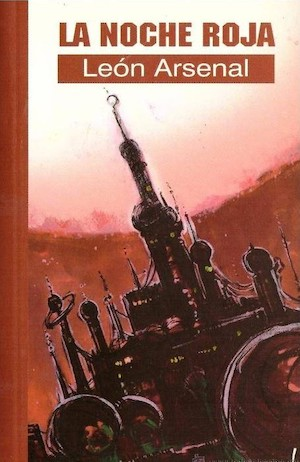

> Este artículo fue publicado tiempo antes de que tuviera un blog, durante el pretérito año 2003, en el ya extinto portal sobre literatura de género [cYbErDaRk.net](http://www.cyberdark.net/portada.php?edi=6&cod=159). Lo he recuperado para dejarlo aquí y que no se pierda, con su fecha original.
>
> El texto no ha sido retocado, pero he cambiado las imágenes incluidas por otras en mayor calidad cuando ha sido posible (era el 2003, tengámoslo en cuenta).

Lo cierto es que ha resultado bastante curioso encontrarse con una iniciativa editorial como esta colección Gotas de Pulp Ediciones. En estos tiempos que corren, donde cada día nos extraña menos encontrar tremendos mamotretos hábilmente divididos en inacabables colecciones, se diría que es hasta chocante que alguien se atreva a publicar novelas cortas. La extensión de estos libros, así como la edición en formato similar al de bolsillo, hacen que el precio final de venta sea increíblemente competitivo incluso comparándolo con las grandes editoriales del país, así que poca excusa quedaba para no hincarles el diente.

De este tercer volumen de la colección, que se nos presenta como historia de ciencia-ficción, me atrevería a decir que es en realidad una mezcla con muchos tintes de novela negra y una ambientación en un mundo futuro.

El protagonista, Cigal Fastul, funcionario de la Oficina para Exteriores, es el encargado de los visitantes extranjeros de paso en Ercunda, un curioso planeta con una rotación de 48 horas, el doble que en la Tierra. Sus habitantes viven en ciclos diurnos y nocturnos, teniendo calurosos días de luz y frías jornadas de noche interminable. Allí las horas de sueño coinciden con los amaneceres y los anocheceres, y son llamados Miquiníes y Stiquies ante la imposibilidad de llamar noche o día a un periodo u otro. Este planeta, Ercunda, orbitado por la gran luna roja Panac, es un inestable avispero político donde los golpes de estado son más habituales de lo deseable. El gobierno actual, poco mas que un régimen dictatorial con su propia policía política, esta pasando por una peligrosa etapa de continuos problemas, atentados terroristas e inseguridad ciudadana.

No es probablemente el mejor momento para la llegada de Cosmos a Moa, un agente terrestre contratado para dar caza a un peligroso asesino cuyo rastro se dirige hasta Ercunda. Si hacemos una rápida traducción, tendríamos a un fumador empedernido que trabaja como agente de aduanas (Cigal Fastul), un investigador privado (Cosmos a Moa) y un criminal fugitivo (Gruu Muna), ingredientes típicos de la novela negra.

Con la ayuda de D.Rae, un misterioso apaciguador (una mezcla entre policía, cazarrecompensas y oficiante de bodas), Fastul irá entrando cada vez mas en las investigaciones sobre el peligroso y aparentemente ilocalizable criminal.

Lo mas interesante del libro es, sin duda, el viaje interior del protagonista, que comienza con una vida cómoda y tranquila y ve como los acontecimientos a su alrededor van influyéndole poco a poco. Su trabajo, normalmente tranquilo, para el gobierno, y su vida en pareja con Bilgrum (Bilgrum3, tercera de cinco hermanas clónicas incapaces de hablar en términos de individualidad), se verán profundamente modificadas por los sucesos que acarrearán la investigación sobre Muna y la amistad de Cosmos a Moa.

Las tramas políticas de las diversas facciones interesadas en el control del planeta se entremezclan con el trabajo gubernamental de nuestro protagonista, con las responsabilidades de Bilgrum en una embajada extranjera y las necesidades de Cosmos a Moa de dar caza a su objetivo en el menor tiempo posible. Todo se irá complicando con el aumento de la tensión política y social que traen algunos atentados terroristas, y obligará a Fastul a ocuparse mas de su faceta policial de lo que probablemente él mismo desea, abandonando una vida de estratégica neutralidad necesaria en un planeta tan inestable.

Para no desvelar más detalles de la trama de los deseados, bastará con decir que la investigación se complica cuando Fastul descubre que Gruu Muna parece tener unas habilidades más allá de lo común.

El libro está escrito sin entrar en grandes piruetas literarias y con una prosa bastante fluída así que, sin duda, se deja leer con mucha facilidad. Esto, sumando al hecho de que el formato sea el de novela corta, ayuda a que el resultado sea bastante positivo. Sin hacer necesarias cientos de páginas, los personajes quedan perfectamente definidos y su forma de actuar es perfectamente creíble, en vista del resultado final. En mi caso particular, el libro me duró una sola tarde de estas pre-veraniegas jornadas abrasadoras, lo que sin duda ayudó a la ambientación en este marciano planeta teñido de rojo que es Ercunda.

Si queremos achacarle algo, quizá se eche en falta una mayor implicación de lo que sería el propio planeta en sí en el argumento del libro. Estas jornadas nocturnas y diurnas hacen que algunos habitantes de Ercunda mantengan prácticamente dos vidas paralelas, e incluso algunos adopten nombres y costumbres diferentes para cada período. Sin embargo, es un factor que apenas influirá en la historia y que hubiese podido dar mucho mas juego. Indudablemente, la historia se basa y se mantiene en otros factores, así que no se le pueden restar méritos.

Del autor poco puedo decir que no se haya dicho ya. Cabría mencionar que León Arsenal es realmente el pseudónimo de un madrileño nacido en 1960, cuya principal obra en cuanto a ciencia-ficción se centra en cuentos cortos, publicados en fanzines y revistas del género. Aparte de eso, una novela a medio camino entre la fantasía heroica y el pulp-fantástico en colaboración con José Miguel Pallarés (Bula Matari) y una antología de relatos (Besos de Alacrán), y su dedicación durante los últimos años a la novela histórica puede ser quizá lo más destacable de este poco prolífico autor.

Como curiosidad editorial, quizá se podría decir que el autor de la portada no es Qeu Nümura, tal y como reza en el libro, sino J.M. Ken Niimura, dibujante de cómic, ilustrador y traductor de japonés. Supongo que se podrá achacar a los duendecillos de la imprenta o a la confusión del autor de este artículo, aunque personalmente optaría por la primera alternativa.
