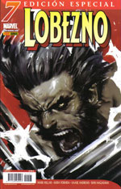

El título de la entrada es un poco tramposo, pero no se me ocurría otro. Me puse a pensar en este tema a raíz del último número publicado en España de la colección de [Lobezno](http://es.wikipedia.org/wiki/Lobezno) (número 7 del volumen 3, Julio de 2006, edición de [Panini](http://www.paninicomics.es/)). Nunca fué una colección completamente de mi agrado, pero desde el anuncio de que [Mark Millar](http://www.millarworld.tv/) iba a ser el guionista de la serie empecé a interesarme más, aunque ese es tema para otro post.

Panini decidió publicar dichas sagas a ritmo de dos números mensuales, sus razones tendría. El caso es que al llegar el número 7, nos encontramos con el último tebeo de Millar y... algo que no debería estar ahí. No pertenece a la serie oficial, sino a una limitada de calidad muy discutible (eufemismo para 'muy mala') perpetrada por dos individuos que no conozco (y no me extraña). No se me ha dado la opción de no comprar ese tebeo. De hecho los próximos números mensuales son la continuación que, por supuesto, no voy a comprar. Nos enfrentamos al abandono de una colección de modo indefinido por culpa de una decisión editorial discutible.

Que duda cabe de que siempre puedo esperar unos meses y continuar cuando retomen la serie original. Pero me conozco, y una vez que pasan varios meses sin preocuparme por qué será lo que incluya el tebeo al verlo en la librería, suele ser muy difícil volver a convencerme. Me pillaron con el reclamo de un buen guionista. Me perdieron por no saber mantenerme después.

Me interesaban [Los Cuatro Fantásticos](http://es.wikipedia.org/wiki/Los_4_Fant%C3%A1sticos) de [Mark Waid](http://en.wikipedia.org/wiki/Mark_Waid), y los de [Straczynski](http://worldsofjms.com/) \[[wikipedia](http://en.wikipedia.org/wiki/J._Michael_Straczynski), [imdb](http://www.imdb.com/name/nm0833089/)\], pero no el Marvel Knights: 4 que quieren obligarme a comprar. Me interesa (y mucho) [Amazing Spider-man](http://en.wikipedia.org/wiki/The_Amazing_Spider-Man), pero no todo eso que incluyen en un tomo. Varias colecciones que no compro pero que podría estar comprando. Quizá otros lectores opinen igual, aunque es algo que desconozco y que no estoy del todo seguro de que estén teniendo en cuenta en Panini.