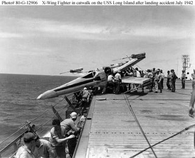

Los X-Wing parecen difíciles de pilotar:

Vía [Enrolados](http://www.enrolados.com/?p=308)

**Actualizado**: Es poco más que obvio que es una fotografía retocada, sobretodo porque en 1942 aún faltaban 35 años para que se estrenara La Guerra de las Galaxias en cine. Y porque el [USS Long Island](http://en.wikipedia.org/wiki/USS_Long_Island_(CVE-1)), tal y como pone en la foto, fue vendido a la Universidad de Rotterdam en el 66, para ser destruído años después.