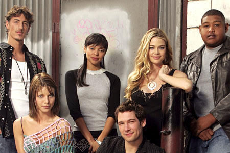

Serie que se emite en [Cuatro](http://www.cuatro.com/), los lunes noche (a partir de las 23:00 creo recordar). La estaba viendo últimamente, ya que se le había dado cierta publicidad, el argumento me atraía... y sale [Denise Richards](http://www.imdb.com/name/nm0000612/).

Ya podemos dejar de verla porque se canceló originalmente antes de terminar la primera temporada, por baja audiencia. [Según tv.com](http://www.tv.com/sex-love-and-secrets/show/32981/summary.html?tag=tabs;summary) (antiguo tvtome.com, que si no es fiable como fuente ya me diréis quién lo es entonces), llegaron a emitirse los cuatro primeros capítulos, fueron rodados ocho, y había planeados diez, creo. Dado que ya llevamos seis doblados, intuyo que emitirán los ocho rodados.

Me pregunto exactamente qué excusa darán después de haber comprado los derechos de una serie no terminada, de haberla vendido como algo interesante que ver durante el verano y de dar verguenza. Esto ya me lo hicieron en Canal+ hace unos años con [Jack & Jill](http://www.tv.com/jack-and-jill/show/1126/summary.html?tag=tabs;summary), y me parece que empieza a ser la tónica general comprar series no terminadas a bajo precio para llenar la parrilla en verano. Este canal me está perdiendo como espectador.

¿Cómo es posible que aún se extrañen de que veamos lo que queramos cuando queramos descargándolo de internet?