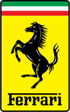

El "Cavallino Rampante" ya es primero. Quedan dos carreras. A ver si el título vuelve a donde debería estar.

El año pasado (entendiendo años por laborables/lectivos, es decir, de Septiembre a Septiembre) fue lo que viene a ser llamado, mayormente, una mierda; en lo profesional, académico, sentimental, familiar... en casi todos los aspectos, incluso en las aficiones. Al menos el Barça se portó, pero el resto... pff.

Así que este año va a mejorar. De hecho ya está mejorando en muchas cosas, y aquí también hay que incluir, de nuevo, las aficiones. A ver si me dan una alegría. Si Schumi gana y Alonso no puntúa ya tendríamos matemático vencedor, mientras que la situación contraria no puede darse aún.

Que tontería más grande, pero es que es Domingo y no tengo otra cosa en que ocupar mi tiempo.
