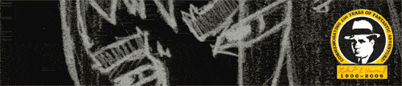

**Un recordatorio**: este año es el centenario del nacimiento de [Robert E. Howard](http://en.wikipedia.org/wiki/Robert_E._Howard), creador literario de la criaturita (entre otras cosas). Todo lo que aparece publicado este año lleva el logotipo amarillo que veis debajo y, aunque yo no tengo los derechos de nada de esto (como es más que obvio) me parecía un detalle incluirlo también en la ilustración de un fan.

**Y también de paso, una recomendación**: los nuevos tebeos de Conan guionizados por [Kurt Busiek](http://en.wikipedia.org/wiki/Kurt_Busiek) con los magistrales dibujos de [Cary Nord](http://www.conan.com/f_cary.shtml). Ya me gustaría a mí (y a cualquiera) dibujar como él. Los originales son de la editorial [Dark Horse](http://www.darkhorse.com/search/search.php?viewmode=gallery&sstring=Conan&sortfield=onsaledate&sortmeth=desc&scope=products&genre=all&type=comic&startmonth=all&startyear=all&endmonth=all&endyear=all&genre=all), en España los edita [Planeta](http://www.planetadeagostinicomics.com/fantasia_listado.asp?cat=375).

