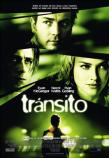

**Rosas Rojas** ([Imagine me & you](http://www.imdb.com/title/tt0421994/)) [Ol Parker](http://www.imdb.com/name/nm0662530/), 2005

Rachel y Heck se casan. En la boda Rachel conoce a Luce, la florista, y surge una química imposible de frenar. Me ha alegrado la tarde del día, hablando de sentimientos bonitos de una forma hermosa y directa. Romanticismo sin comedia. Lástima que alguien tenga que salir perdiendo siempre en estas películas.

Y tiene la mejor escena de "amago de beso de sí pero no" que he visto nunca. 

**Tránsito** ([Stay](http://www.imdb.com/title/tt0371257/)) [Mark Forster](http://www.imdb.com/name/nm0286975/), 2005

De esta no os puedo contar nada sin estropear el argumento, así que no lo voy a hacer. Alguien tiene un accidente, o no. Las cosas no son lo que parecen, aparece alguien que puede predecir el futuro, o quizá no es el futuro, o... Perfecta para ver de noche, sólo y sin otra cosa que hacer, pero mala idea para una tarde con compañía, porque así pierde mucho.

Demasiado lenta en general y con muchos altibajos en el ritmo, así que la gente alrededor molesta más que ayuda. El montaje es genial, eso sí. Y buena banda sonora. 