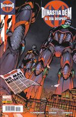
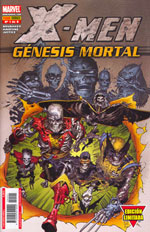
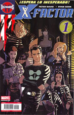

Si es que no escarmiento, pero dado que hay un evento Marvel (otro más) que da la oportunidad de leer (teóricamente) algunas cosas interesantes, para allá que he ido de cabeza. Ya hace tiempo que no leo mutantes, sobretodo porque la mayor parte de lo que se publica es... ummm... ¿una escoria infecta?

> Compré **Astonishing X-Men**, claro, de Josh Whedon lo que sea. Y el **Lobezno** de Mark Millar también. Supongo que uno acaba siguiendo a autores y no a personajes. ¿Qué otras cosas publican? **Patrulla-X** de Claremont: paso, personajes que no conozco en situaciones estúpidas. Parece más bien un eXcalibur 2. **X-Men** de Peter Milligan: paso aún más, además Larroca cada día dibuja peor. Mucho peor. **Lobezno**: psé, después de Mark Millar vineron unos japoneses que hicieron lo peor que he leído en mucho tiempo, así que lo dejé. Ahora vienen los argumentos posteriores a House of M, que pueden ser interesantes, pero el guionista para mí es nuevo... si paso por una librería un día que esté aburrido igual hasta me lo compro, pero no me llama demasiado. **New X-Men**: no tengo ni idea, pero a priori parece tan horrenda que prefiero no opinar mucho.

Eso me deja en: publican un millón de series (como siempre) pero las dos que eran interesantes ya no lo son (Astonishing continuará dentro de bastante tiempo y Lobezno ha cambiado de autores). El resto es morralla.

En éstas que llega el nuevo evento Marvel en España: House of M. Toda la realidad se ve modificada por la Bruja Escarlata porque... exceso de stress supongo, quizá mobbing en Los Vengadores, qué más da. Otro de esos personajes que toda la vida han sido molones pero secundarios, se hinchan de poder... y ¡puf! Realidad cambiada. Los cuatro números que narraban lo sucedido en esa realidad nueva (la colección **House of M**) me los compré y me gustaron mucho. El truco ya me lo conozco así que no piqué con ninguna de las demás colecciones (casi todo Marvel) que salieron esos meses con el sello indicativo de que tenían "algo" que ver. En esa realidad Magneto era el Rey (Magneto siempre es el Rey, sólo que ahora lo era más), pero algunos personajes pasan a tomar conciencia de que las cosas no son "como deberían", se parten la cara entre todos (que es como realmente se solucionan las cosas) y se restaura la continuidad normal.

Para volver al mundo "real", la Bruja Escarlata pronuncia las palabras: **No más mutantes**, y (a ojo) al menos nueve de cada diez mutantes del planeta dejan de serlo. No más poderes, sin opción de recuperarlos por ningún medio. Los mutantes vuelven a ser pocos, a estar perseguidos y ser odiados. Todo un acierto editorial desde mi punto de vista, porque hoy en día había tanto mutante que parecía que no serlo era la señal para que te discriminaran en los tebeos.

Consecuencias: si me dieran un euro por cada vez que en Marvel se ha dicho "y las cosas nunca volverán a ser igual" tendría... pues no sé, pero cuatro o cinco por lo menos. Esta vez parece que los cambios durarán, aunque seguro que acaban siendo permanentes sólo para los personajes de relleno.

Bajo esta nueva situación comienzan los tebeos que se publican a partir de ahora, con resultados dispares. Dado que las colecciones ya existentes, como ya he explicado más arriba, vienen a ser ilegibles, no me van a engañar por mucho que lo publiciten. Así que os comento lo que me han parecido las series nuevas, que son con las que me he arriesgado a ver qué tal.

**Dinastía de M: El Día Después** **Guión**: [Chris Claremont](http://en.wikipedia.org/wiki/Chris_Claremont) **Dibujo**: Randy Green y Aaron Lopresti

Al final piqué. Pensé que esto era lo que venía justo antes de Génesis Mortal (ver más abajo) y como era únicamente un número autoconclusivo me lo llevé. Error. Es un tebeo que no termina y que te dirige a comprar la serie madre X-Men. Y además es de lo más normalito del mundo. Claro que Claremont lo único decente que ha hecho en la última década fueron las primeras sagas de Extreme X-Men (y gracias). Clichés, clichés, clichés, dibujo bah y no termina. No lo compres si aún estás a tiempo. De nada. 

**X-Men: Génesis Mortal (1 de 6)** **Guión**: [Ed Brubaker](http://en.wikipedia.org/wiki/Ed_Brubaker) **Dibujo**: [Trevor Hairsine](http://en.wikipedia.org/wiki/Trevor_Hairsine) (y otro tipo en un extra de 8 páginas que no sé a qué viene aparte de a encarecer el tebeo en 80 céntimos)

Es una limitada de seis números, así que puedo arriesgarme. Es de Brubaker con lo que mala tampoco va a ser. En principio me chocaba, porque este escritor es perfecto para un personaje como Batman, para thrillers o género negro/policiaco, pero los X-Men... no me casaban mucho con lo suyo. Pero oye, parece que da el pego. Aparece un malo nuevo. Yo voto por Legión que ha vuelto de donde estuviera (¿muerto? No lo sé). Es lo bueno que tiene no leer los avances de los tebeos americanos, que no conoces el argumento hasta que lo lees (seas quien seas si sabes quién es y me lo dices estropeándome la historia, tendrás mi odio eterno).

Suficiente calidad como para asegurar que voy a comprar los seis números. No se puede valorar mucho más hasta ver la historia completa, así que tendrá que valer con esto. o , según de qué humor estemos. Ya veremos cómo sigue.

**X-Factor #1** **Guión**: [Peter David](http://en.wikipedia.org/wiki/Peter_David) **Dibujo**: [Ryan Sook](http://www.ryansook.com/)

Peter David no pasará a la historia por ninguna historia realmente realmente buena, pero sí lo hará por el hecho de que prácticamente todo lo que escribe es bueno. Todo. Y esto no es la excepción. Ryan Sook es bueno. Es otro clon de Adam Hughes pero es bueno. La historia está bien, los personajes están muy bien tratados (Madrox es sublime) y el final es sorprendente. Este tipo sólo necesita 24 páginas para hacer un buen tebeo, y encima es una serie abierta. Otra para la saca. La agencia de detectives X-Factor tiene una cita con mi estantería cada mes. ¿Qué podemos esperar de una serie cuyo subtítulo en portada es "Espera lo inesperado"? Léelo. 