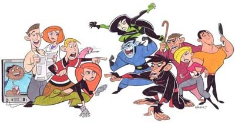

Como decía [el otro día](/centremonos-un-poco/), Disney hace una década que no hace nada ni mínimamente decente. Hoy al levantarme tenía que elegir entre seguir con mi plan de dominación mundial o ver la tele un rato, que es algo que últimamente ya no hago (normal, con lo que ponen), y opté por la tele. Haciendo zapping después de una película me dió por llegar a los canales de animación, donde hace mucho que tampoco hay nada interesante. Desde las [Super Nenas](http://en.wikipedia.org/wiki/Powerpuff_girls) y [Samurai Jack](http://en.wikipedia.org/wiki/Samurai_Jack) en [Cartoon Network](http://en.wikipedia.org/wiki/Cartoon_Network) no he vuelto a ver nada que me llame la atención. Y las [Guerras Clon](http://en.wikipedia.org/wiki/Star_Wars:_Clone_Wars), claro. Las tres series creadas por [Genndy Tartakovsky](http://en.wikipedia.org/wiki/Genndy_Tartakovsky), da que pensar. Quizá lo único que se le puede acercar actualmente sea [Kim Possible](http://en.wikipedia.org/wiki/Kim_Possible) \[[tv.com](http://www.tv.com/kim-possible/show/8258/summary.html)\], que es precisamente lo que estaban echando en [Disney Channel](http://en.wikipedia.org/wiki/Disney_Channel).

Al menos son series que no asumen que los espectadores son niños con problemas de desarrollo emocional, y mantienen un ritmo decente para que un adulto pueda verlas. Ya se sabe, la "sutil" diferencia entre "infantil" y "para todos los públicos" que los productores no suelen percibir. Ésta es para todos los públicos, y se deja ver bastante bien.

El malo de Kim, el [Dr. Drakken](http://en.wikipedia.org/wiki/Doctor_Drakken), tiene como asociada al mejor personaje de la serie, [Shego](http://en.wikipedia.org/wiki/Shego), que hace de contrapartida de la protagonista y acaba siendo la más interesante. De hecho en la [primera película](http://en.wikipedia.org/wiki/Kim_Possible:_A_Sitch_in_Time) todo transcurre en un futuro donde Shego ha dominado el mundo y ha esclavizado a todos, incluyendo a su jefe Drakken.

Cuatro temporadas ([lista completa](http://en.wikipedia.org/wiki/List_of_Kim_Possible_episodes)), dos películas (la primera que os comentaba es genial) y seis videojuegos. La verdad es que sigue siendo una tontería como cualquier otra serie pseudo-infantil, pero tiene su gracia. Para una mañana aburrida de sábado es suficiente.