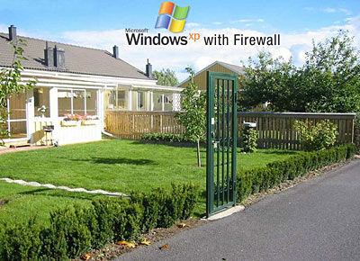

El ordenador de sobremesa de mi casa estaba empezando a hacer cosas... raras. A veces el disco duro se ponía a hacer unos ruidos muy feos. A veces el firewall decidía tomarse un descanso y volver a arrancar al cabo de un rato. Este fin de semana me cansé ya de tanta tontería y estuve aplicándole cirugía de emergencia, revisando los servicios que estaban funcionando, echándole un vistazo al registro del sistema, desfragmentando todo el disco duro a ver si ganaba un ápice de velocidad de acceso, revisando las instalaciones de ciertos programas y aplicando un par de programas de búsqueda de potenciales errores. Tengo que seguir vigilándolo a ver si ya ha vuelto a su modus operandi habitual o no, no vaya a ser que esté simplemente disimulando y se ponga a fallar cuando no miro.

El caso es que me he acordado de esto y he pensado en compartirlo:

Nunca confíes en tu Windows... vigílalo.