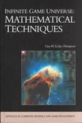
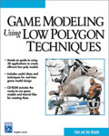

Un par de libros que he pedido por internet y me han llegado esta semana. Aún no he podido leerlos, así que ya os contaré cuando me haya puesto con ellos. Por cinco euros que me han costado cada uno no sé cómo no he comprado más libros.

**[Infinite game universe: Mathematical Techniques](http://www.charlesriver.com/books/BookDetail.aspx?productID=8720)** Guy W. Lecky-Thompson

Técnicas matemáticas para generar contenido procedural, especialmente en lo referente a creación de videojuegos. Es decir, en lugar de tener (por ejemplo) mapas o niveles prediseñados y jugar siempre a lo mismo, cómo hacer que sea la máquina quien cree el contenido por ti.

Tiene buena pinta. Habla, entre otras cosas, de números aleatorios, probabilidad, fractales, etc. Además con un libro que pone "Mathematical Techniques" en portada uno parece aún más listo.

[**Game modeling using low polygon techniques**](http://www.charlesriver.com/Books/BookDetail.aspx?productID=8717) Chad y Eric Walker

Éste ya es un poco viejo y realmente no lo quiero para nada importante, porque mi capacidad como artista 3D es más bien limitada. Para eso están los grafistas. Pero como de vez en cuando tengo que hacer alguna cosilla rápida para probar con código mío, me pareció que no estaría mal echarle un vistazo, a ver si puedo acelerar un poco el proceso.

Habla sobre creación de modelos 3D con el menor número de polígonos posible, para que pueda ser utilizados eficientemente en videojuegos, donde los modelos comunes 3D con cientos de miles de polígonos no pueden moverse en tiempo real.
