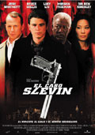

")**Infiltrados** ([The Departed](http://www.imdb.com/title/tt0407887/)) [Martin Scorsese](http://www.imdb.com/name/nm0000217/), 2006

Después de bodrios infumables como [Gangs of New York](http://www.imdb.com/title/tt0217505/) o [El Aviador](http://www.imdb.com/title/tt0338751/) (y el que opine lo contrario tiene el criterio afectado por la fama del director), ya daba por perdido a Scorsese, pero en mi modesta pero infalible opinión se ha redimido con creces. La historia de un infiltrado de la policía en la mafia y un infiltrado de la mafia en la policía, aunque uno siempre duda de cuál es cuál. [DiCaprio](http://www.imdb.com/name/nm0000138/) se come a todos los demás actores y va a más en cada película. [Jack Nicholson](http://www.imdb.com/name/nm0000197/) está cada día más histriónico y como no se controle se va a echar a perder del todo. [Matt Damon](http://www.imdb.com/name/nm0000354/) en su línea (escuela de cine del "mismo rostro para todas las emociones"). Tensión hasta el final, que podría haber firmado Tarantino.

**Los hijos de los hombres** ([Children of Men](http://www.imdb.com/title/tt0206634/)) [Alfonso Cuarón](http://www.imdb.com/name/nm0190859/), 2006

Basado en la [novela homónima](http://tienda.cyberdark.net/hijos-de-hombres-n11074.html) de [P.D. James](http://en.wikipedia.org/wiki/P.D._James), dato que no tiene por qué importar a nadie. Tiene un algo que qué se yo que no acaba de hacer la película redonda al 100%, pero desde luego es buena. La huída en el coche que no arranca me parece una de las mejores huídas en coche de la historia del cine. Quizá un poco plana la creación de personajes, pero contando con [Clive Owen](http://www.imdb.com/name/nm0654110/) (quizá mi actor favorito en estos momentos) no hace falta mucho más, transmite lo que necesita sin necesidad de palabras que lo expliquen. Final abierto, como tiene que ser, tiroteos espectaculares, la salsa de la vida. Y una verdad como un puño: "lo triste es que el mundo ya estaba jodido antes de que dejaran de nacer los niños". El último en morir por favor que apague la luz.

**El caso Slevin** ([Lucky Number Slevin](http://www.imdb.com/title/tt0425210/)) [Paul McGuigan](http://www.imdb.com/name/nm0006476/), 2006

Y la mejor para el final. Genial [Josh Hartnett](http://www.imdb.com/name/nm0001326/), con un personaje fantástico. Argumento sorprendente hasta el último minuto, pero con pequeñas pistas que te permiten ver por dónde van las cosas, como en las buenas películas de intriga. Hay una conversación sobre James Bond en la película, eso da dos puntos más. Y [Lucy Liu](http://www.imdb.com/name/nm0005154/) con falda tableada, como una colegiala, otros dos puntos. Reparto estelar, con [Bruce Willis](http://www.imdb.com/name/nm0000246/), [Morgan Freeman](http://www.imdb.com/name/nm0000151/) y [Sir Ben Kingsley](http://www.imdb.com/name/nm0001426/), que hacen papeles correctos que podrían haber interpretado otros de menor fama. Unas cuantas sonrisas, algo de emoción, intriga y unas gotas de drama para el final. ¿Que más le podemos pedir a una película?
