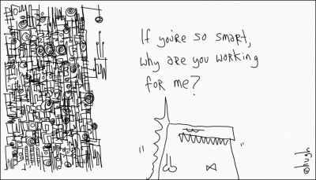

Dado que [planes anteriores](https://neverbot.com/recetas-para-una-vida-mejor/) parecen no concretarse, y hoy estoy sentado en mi mesa con unas inmensas ganas de levantarme y gritar:

> Menos mal que no existe un colegio de informáticos y no es obligatorio firmar proyectos, porque si yo tuviera que firmar esto, ¡no lo haría! Si el código es poesía, yo estoy escribiendo El Código Da Vinci de todos los programas. ¡No se puede trabajar así!

Pero en lugar de gritar he recordado una de las viñetas de la semana pasada de [Gaping Void](http://www.gapingvoid.com/):

