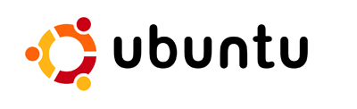

Ya está, ya me cansé. Al hilo de [un post de hace poco](/inteligencia-artificial/) sobre los "Expedientes X" que estaban produciéndose en mi(s) ordenador(es) con Windows XP, he de añadir que ya me he cansado.

No soy un usuario inexperto mosqueado con nadie, ni me he dejado llevar por la publicidad de unos o de otros. He trabajado durante bastante tiempo como administrador de sistemas y creo que sé de lo que hablo. Siempre he tenido dos excusas que me han servido para seguir manteniendo Windows como mi sistema operativo "por defecto", utilizando otros únicamente para solucionar problemas concretos e identificables (siempre hablando de PCs, claro está):

* Linux siempre me ha parecido un sistema para propósitos concretos, no de uso general. Como servidores, para desarrollo, para instituciones o laboratorios, sería mi primera opción, pero como ordenador de sobremesa nunca lo he visto del mismo modo que Windows. Tradicionalismo, quizá. A un usuario medio le enseñas el directorio raíz de un Linux cualquiera y no sabe donde está nada (y no me extraña, porque la mitad de las veces yo tampoco).
* Quienes se quejan de Microsoft generalmente no saben utilizar su sistema operativo con la misma profesionalidad con la que saben configurar un millón de cosas en un Linux. Si indagas dentro de un Windows generalmente las cosas se pueden toquetear bastante. Al final todo se resume en un "a mí me funciona y no se me cuelga ni me funciona mal".

Pero es que ya me da igual, porque esto ha cambiado mucho últimamente:

* He probado un poco [Ubuntu](http://www.ubuntu.com/) en el portátil. Me parece lo suficientemente intuitivo como para querer utilizarlo. Y si algo se pone tonto, está basado en [Debian](http://www.debian.org/) así que asumo que podré meter mano todo lo posible (otro de los equipos que tengo en casa lleva Debian, así que experiencia hay). Me parece la piedra angular que necesitaba para empezar una mudanza seria, algo que representa lo mismo que Firefox en el mundo de los navegadores. Es algo que parece serio, profesional, sencillo, potente... Qué mas voy a contar que no se sepa ya.
* Por mucho que vigile mi ordenador, ahora ya me ignora. Estoy cansado de tener un firewall que se mosqueda con el antivirus, y viceversa. Ni que decir que tener ambas cosas funcionando constantemente, más el desorbitado consumo de recursos que WinXP ya lleva "de serie" hace que parezca que mi ordenador tiene cinco años más. Es un PIV a 2,4 GHz, y para lo que lo uso tendría que ir como un cañón. Harto de instalar programas anti spyware/adware/etc. Harto de que un problema que debería ser simple se transforme en horas de buscar la razón original de la que no se te proporciona información.
* Harto de que ayer le dieran al ordenador de sobremesa yuyus muy raros y se quedara en estado catatónico durante varios minutos antes de dejarme seguir con lo que estaba haciendo. Harto de que ayer tardara varias horas en grabar unos míseros dvds. Lo siento pero mi tiempo vale dinero, y Microsoft está acaparando ese tiempo.

Así que llevo todo el día haciendo una gran limpieza en ese ordenador. Un disco duro IDE de 40 GB, otro SATA de 160 y uno externo USB de 250. Es sorprendente lo que uno almacena con el paso del tiempo. He tenido que limpiar bastante, pero ya estoy en condiciones de empezar con la migración. Porque si las cosas se hacen, se hacen bien. Me olvido de compaginar varios sistemas operativos y demás mandangas. Me voy a instalar la última versión de [Ubuntu](http://www.ubuntu.com/) (6.10) y que sea lo que [El Monstruo Espagueti Volador](http://es.wikipedia.org/wiki/Pastafarismo) quiera.

Iré informando de los posibles problemas que una migración completa puedan traer. Así, a bote pronto, no sé como me irá el tema de la grabadora de dvds, o la descarga de archivos por redes P2P, porque nunca he usado programas para esas tareas bajo Linux. Para otras cosas la mayor parte del software que voy a utilizar ya es como de la familia, pero habrá que ver qué tal me va en el día a día.

Ya os contaré.
