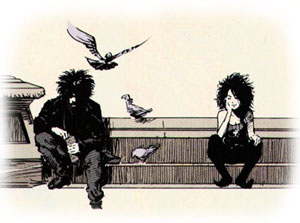

Acabo de terminar de leerlo, y es... en fin, es como... digamos que simplemente es. No voy a escribir una reseña absurda con una puntuación al final porque creo que no lo merece. Después de ocho tomos maravillosos con algunas de las más hermosas historias que haya leído nunca (bien sea en narrativa gráfica o textual), creía tener claro qué podía esperar de los volúmenes restantes. Pero no. Hasta ahora no parecía haber un hilo conductor claro, y entendía Sandman como un "campo de juegos" para Neil Gaiman, donde hacía y deshacía, y donde jugueteaba con todas las técnicas narrativas que se le ocurrían sin orden ni concierto, teniendo como fin último probablemente la mera estética. La hermosura del Arte con mayúsculas.

Sueño y su hermana mayor, Muerte

Pero no. Resulta que en el tomo nueve todo parece adquirir un sentido nuevo y se ve que todo viene de alguna parte y va hacia alguna parte. De hecho me parece una narración tan grande en su concepto que los cientos y cientos y cientos de páginas que ya he leído con anterioridad se me antojan nuevas otra vez. Creo que tras ver cómo todos los personajes aparecen de nuevo y van encajando en un puzzle mayor las historias previas deberían ser releídas para descubrir muchos pequeños detalles que en su momento dejé pasar sin prestar la suficiente atención. Y me queda el décimo tomo que, intuyo, será algún tipo de epílogo.

Trece capítulos recopilados en un único volumen que constituye el, por ahora, mejor tebeo que he tenido el gusto de leer. Creo que entra directamente en esa categoría de obras a las que todo el mundo debería acercarse antes o después.