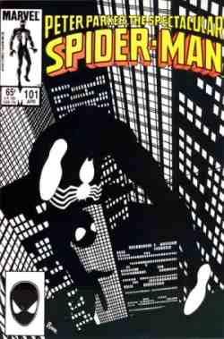

Estaba dándome una vuelta por [tebelogs](http://tebelogs.dreamers.com/), viendo noticias varias cuando, de rebote, me encontré con esta portada de [John Byrne](http://en.wikipedia.org/wiki/John_Byrne) de hace ya mucho tiempo (cuando todavía sabía coger el lápiz, y dibujaba más que hablaba). Vía [Bushi-comics](http://bushi-comics.blogspot.com/2006/11/spiderman-vuelve-al-negro-y-eso-me.html).

Haz click para verlo más grande, como si tuviera que explicarlo...

Y el caso es que estoy de acuerdo con el post original, una portada que sólo utiliza el blanco y el negro puede representar toda una época y puede transmitir muchas cosas en un dibujo que, a priori, sólo es de un tipo imaginario que se viste con un pijama para dar de leches a la gente.