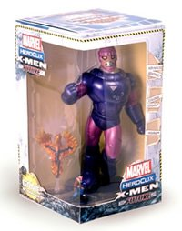

[Marvel Heroclix: Days of the future past Action Pack](http://www.wizkidsgames.com/heroclix/marvel/products.asp?cid=40852): Lo encontré ayer por 25 euros en el Arte 9 de Doctor Esquerdo (Madrid, claro). La tienda de la calle Cruz tiene página web, pero es tan horrible que no voy ni a enlazarla.

Incluye la figura del centinela, Rachel Summers con el fénix y el Lobezno viejuno del tebeo. Los dos personajes pequeños coloreados en gris (como figuras únicas) y el Centinela en rojo (aunque creo que tiene reglas para jugar con diferentes valores de puntos). [Lista de figuras de la caja](http://www.wizkidsgames.com/heroclix/marvel/figuregallery.asp?releaseid=88).

Está basado en el tebeo homónimo, claro, no creo que sea necesario explicárselo a nadie que llegue hasta aquí. Por si acaso [enlazo con la wikipedia](http://en.wikipedia.org/wiki/Days_of_Future_Past) que lo sabe todo, por si tenéis alguna duda. Una de las sagas clásicas de los X-Men.

No pude comprar el centinela original antes de que se agotara por mendrugo (pensé que siempre podría comprarlo más adelante), así que ahora al menos ya tengo uno. Aun así, si algún día encuentro en alguna tienda la figura con la caja original me la compraré igualmente. Es lo que tiene el frikismo. El mes que viene ponen a la venta [otra caja](http://www.wizkidsgames.com/heroclix/marvel/products.asp?cid=41118) con personajes de [Marvel 2099](http://en.wikipedia.org/wiki/Marvel_2099), aunque esa me interesa menos (pero se de gente a quien sí le interesará). Hasta que no aparezca por aquí la [caja de Invencible](http://www.wizkidsgames.com/heroclix/indy/figuregallery.asp?releaseid=75) no hay más compras Heroclixeras.

Y aprovechando que estoy mirando la página de Wizkids, voy a echarle un vistazo a la lista de figuras de la última expansión, [Supernova](http://www.wizkidsgames.com/heroclix/marvel/products.asp?cid=40853), a ver si con un poco de suerte no hay ninguna figura nueva de la Hermandad de Mutantes y así no tengo que conseguirlas.

**Actualizado**: Era mucho pedir. Sabia en amarillo y azul, Mancha solar en azul y Nocturne (ésta no sé quién es, investigaré) en azul. Ummm... juntando a la Bruja Escarlata, Sabia y Destino, ya son tres personajes con control de probabilidad. Me voy a hartar a repetir tiradas cuando no me gusten. Desgraciadamente creo que han vuelto a contratar a algún inepto, porque algunas figuras vuelven a ser horrendas.