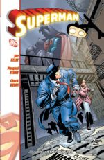

14 euros tirados a la basura. No sé si estoy siendo lo suficientemente claro. Un tomo de tapa dura que intenta tirar del sentimiento patrio para conseguir compradores que se dejen engañar por el hecho de estar dibujado por un español. Son números sueltos sin relación ninguna, meros fill-ins entre sagas del personaje. El guionista, [Joe Kelly](http://en.wikipedia.org/wiki/Joe_Kelly_%28comics%29), tampoco es que se luzca. Exceptuando la historia del quiosquero desaparecido todas son perfectamente olvidables. Y el dibujo de [Ferry](http://en.wikipedia.org/wiki/Pasqual_Ferry), que debería ser la razón principal para querer hacerse con el tomo, tampoco pasa de ser simplemente correcto. Yo creo que puede hacerlo mejor.

Los añadidos son una serie de prólogos escritos por el dibujante antes de cada número. Explican perfectamente por qué los dibujantes dibujan y los escritores escriben, un editor que hubiese revisado faltas de ortografía y gramática no habría estado mal (de verdad, las comas existen para algo, no para ponerse donde a cada cual le apetece). Además no me añaden nada como lector aparte de contarme que el dibujante acabó bastante quemado con su experiencia dibujando al personaje. Entre número y número se incluyen también algunas de las páginas... pero idénticas a las finales. Quiero decir, con color y tinta. Para eso no necesito que me repitan el mismo dibujo que ya está 10 páginas más atrás. Haber incluído los lápices hubiese sido una mejor idea, para poder apreciar cómo era el dibujo original. Y la tapa dura no era necesaria para encarecer un producto que no lo necesita. Una única estrella y porque no puedo poner menos. 

Por lo que he visto, el [Adam Strange](http://en.wikipedia.org/wiki/Adam_Strange) de Ferry será bastante mejor en cuanto a dibujo, aunque creo que no es una historia completa, y continúa en la serie de [La guerra Rann-Thanagar](http://en.wikipedia.org/wiki/Rann-Thanagar_War), así que dudo mucho que lo compre.

Cada mes que pasa veo a [Planeta](http://www.planetadeagostinicomics.com/home.asp) más perdida con las ediciones de DC. Hace un par de meses dejé Superman y Batman porque se publican en unas ediciones horribles e ilegibles. Ahora he tenido que dejar Nuevos Titanes y Flash (porque han multiplicado su precio por dos y por algún sitio hay que recortar gastos). Y cada día tengo menos confianza en los tomos que van sacando. Menos mal que aún me quedan las reediciones de Vértigo (y [Green Arrow](http://en.wikipedia.org/wiki/Green_Arrow), claro).

**Actualización** (gracias a los nuevos comentarios):

*   Aclarar que los números no son fill-ins en realidad, ya que no van entre sagas. Son números "sueltos" (no sé como llamarlos) que no forman una saga en sí. Uno o dos números seguidos con principio y fin. No sé si es práctica habitual en Superman (Action Comics) o va por rachas... debe ser que me estoy (mal)acostumbrado a sagas de seis números mínimo, y cualquier otra cosa siempre asumo que son de relleno...
*   Y los textos no están escritos por Pasqual Ferry, sino que son una transcripción de una grabación. Como textos "hablados" tiene más sentido... pero un texto no puede pasarse a prosa así sin más, hay que "adecuarlo". El editor, colaborador, redactor, o becario que lo haya hecho debería plantearse que así las cosas no quedan bien y parece muy poco profesional.