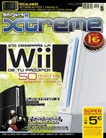

Por todos es bien sabido que el "periodismo" (entrecomillo porque de lo contrario no puedo parar de reír) especializado en videojuegos deja mucho que desear. Hace ya unos meses comenzó a editarse la versión española de la prestigiosa revista [Edge](http://www.edge-online.co.uk/) inglesa. Qué duda cabe de que es la mejor revista de videojuegos del planeta. Y punto. La versión española está bastante lejos de alcanzar esos niveles de calidad; los contenidos los publican tarde y en algunos casos mal, y los contenidos propios me parecen bastante poco interesantes. Todo queda como... como muy impersonal. Como esas revistas técnicas que a veces compras en los grandes kioscos de las estaciones y lees durante un viaje, y no puedes evitar pensar que no son más que una mala traducción de una revista extranjera.

Hace unos meses la revista Superjuegos (que nunca pude tragar, no era nada personal... realmente no sé la razón pero es una revista que nunca me llamó la atención) comenzó a cambiar un poco su línea editorial, incluyendo un suplemento llamado Xtreme, que intentaba cambiar un poco la forma de hacer "periodismo" (vuelvo a entrecomillar). No puedo opinar si es realmente diferente a lo que hacían antes, porque ya digo que antes no la leía.

El caso es que tras unos números lo que era el suplemento ha devorado desde dentro a la revista en sí, que ha pasado a llamarse Xtreme (abandonando por fin un nombre excesivamente infantil para mi gusto) y, parece ser, remozando todo un poco. Me llamaba la atención las intenciones que tenían los que estaban detrás de la publicación (cambiar un poco cómo se hace esto y tal) pero, más que cómo, me llamaba la atención quiénes lo hacían. Siendo [John Tones](http://www.mondo-pixel.com/) uno de los redactores jefe, al final me arriesgué a echarle un vistazo a los dos primeros números. Al menos he esperado dos números para escribir opiniones, que ya es más de lo que han hecho la mayoría, que a veces nos pueden las prisas.

**Positivo:**

*   A algunas de las personas que colaboran/escriben/redactan/llámalocomoquieras ya las sigo habitualmente en otros medios (por ejemplo, 1, 2, 3, responda otra vez, sus blogs), y tengo sus opiniones acerca de estos temas en alta estima. No a todos. Lo cual no quiere decir que siempre tengan razón, claro, pero es un buen principio.
    
*   Me gusta la línea gráfica, no llega a ser estridente ni llega a ser sobria. No está mal.
    
*   Es barata.
    
*   Las previews (sección "supernuevo") tienen pequeños detalles que las hacen más personales, como las frases "si fuera..." o un pequeño párrafo sobre los creadores del juego.
    
*   Tiene un anuncio de la Man... eso significa una foto a página completa de Kira Miró, y eso siempre se agradece.
    
*   La sección Retro es muy buena. La nostalgia justa, pero sólo con las cosas buenas... ponernos nostálgicos simplemente porque sí no nos lleva a ningún sitio. Muy grandes los contenidos de [Chaiko](http://elchaiko.blogspot.com/). Y la portadilla de [Diego Latorre](http://www.diegolatorre.com/) es genial.
    
*   Me interesa la sección "Try again", donde se habla de juegos que pueden haber pasado desapercibidos pero aún están en el mercado. A mi juicio deberían ampliarla.
    
*   Que dediquen reportajes a los juegos con Mega-Hype. Todos queremos leer sobre ellos, para qué engañarse.
    
*   Que dediquen reportajes a los juegos que están justo a la sombra de esos, para que no nos saltemos posibles joyas.
    
*   Que haya reportajes. Los reportajes y las columnas de opinión son lo que hace que la revista tenga calidad, el resto se puede encontrar en internet más rápido.
    

**Cosas que ni fu ni fa:**

*   Las guías o ayudas de juegos... ya tengo gamefaqs y google. Internet es muy grande y seguro que encuentro guías más amplias escritas por gente con más conocimientos sobre cada juego. Es lo que tiene la red, que pone en contacto a gente con mucho tiempo libre que perder.
    
*   La sección de novedades en sí misma. Teóricamente es la razón de ser de una publicación de este ramo, dar a conocer lo que sale al mercado... pero a mí me da igual lo que sale al mercado y lo que no, yo lo que quiero es que me hablen de juegos, y de juegos buenos. Comprendo que los publicistas no pagarían lo mismo si se habla de toda su línea que si sólo se habla de los juegos decentes que publican. Un mal necesario.
    
*   El termómetro que aparece en las novedades para comparar el juego con otras opciones "similares": no siempre son similares, a veces son de otras plataformas, y además ocupa mucho si incluimos las carátulas de los juegos. Si sólo estuvieran los nombres de los juegos en texto ocuparía menos espacio e informaría lo mismo (o más).
    

**Negativo:**

*   Algunos reportajes siguen siendo publireportajes, como el de "50 razones para comprarte una wii" dónde realmente hay menos de media docena de razones reales y/o convincentes. El hype de la diversión también existe.
    
*   Muchos de los colaboradores siguen firmando con pseudónimos. Esto no es un foro, es una publicación profesional. No me imagino un telediario donde un tal "Mr. Proper" me cuente las noticias. Bien es cierto que a muchos se les conoce más en internet por su "nick" que por su nombre real... podrían poner ambos.
    
*   Las novedades siguen llevando notas (y bastante hinchadas)... pero todos sabemos que es un mal necesario y que tampoco molesta tanto. Hay que leer el texto para compensar.
    
*   [Marta Peirano](http://www.lapetiteclaudine.com/) es probablemente la mejor colaboradora con la que cuentan pero yo creo que sus columnas están un poco "desenfocadas". Y lo que dijo en el primer número no me acaba de cuadrar que se lo crea realmente, incluso intentando entender la metáfora... escribiría sobre ello pero descentraría el tema de conversación. Veremos por dónde sale el mes que viene.
    
*   Algunos reportajes, como el de "superhéroes a cascoporro" (gran título) no son todo lo profundos que deberían ser. Si vamos a echar un vistazo histórico al tema, hagámoslo de verdad en lugar de ocupar la mitad de la página con cuadros de colores. Otros hacen el amago de crear polémica (PES vs. FIFA) pero realmente no cuentan gran cosa. Otros son cojonudos, eso es cierto.
    
*   Demasiada puntuación para el Gears of War. Pero las opiniones son como los culos, todos tenemos uno, y el mío no tiene por qué ser el más válido.
    
*   La sección "Noticias Zeta": me dan igual las noticias sobre el grupo editorial. Sobra. La sección "superjuergas": tres páginas dedicadas a hablar sobre los propios redactores me parecen demasiadas para cualquier ego. Obviamente sobran. Además casi todos tenemos blogs, nuestros egos ya deberían estar cubiertos.
    
*   Con el segundo número dan un regalo... mal empezamos. No quiero regalos, quiero una revista.
    

**Conclusiones:** ¿Mejorable? Sí, claro. Como todo en esta vida. ¿Recomendable? Sí, desde luego. Yo le voy a conceder unos pocos números más porque me está gustando. Y para seguir con la comparación, con la Edge española aguanté sólo dos números.

**¿Qué cambiaría?** Ummm... por orden de importancia de mayor a menor: Pondría los nombres reales de los redactores, me parece esencial para dar credibilidad, aunque muchos me discutirán esto. Quitaría las dos últimas secciones de noticias zeta y superjuergas. Y ampliaría las secciones Try Again y Retro con ese espacio. Del resto de la revista, ya sabes lo que dicen: si no está roto, no lo arregles.

**Algunos otros sitios donde hablan del tema** (si encuentro más ya iré actualizando esto):

*   [a Clockwork Orange](http://www.cworange.net/index.php?entry=entry061224-104257)
*   [El blog de Manu](http://manuelsagra.wordpress.com/2006/12/01/superjuegos-xtreme/)