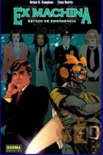
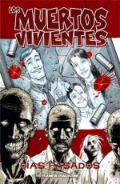
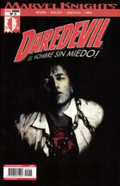
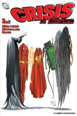
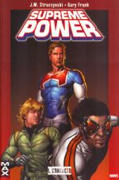

Estamos a principio de año, y es costumbre echar un vistazo atrás para sacar conclusiones acerca de lo que ha dado de sí el año anterior. En el mundo tebeístico, de entre todo lo que he podido leer (quedan cosas pendientes, claro), mis favoritos han sido éstos (**sin ningún orden particular**):

[Ex Machina](http://en.wikipedia.org/wiki/Ex_Machina_%28comics%29) Guión de [Brian K. Vaughan](http://en.wikipedia.org/wiki/Brian_K._Vaughan), dibujo de [Tony Harris](http://en.wikipedia.org/wiki/Tony_Harris_%28cartoonist%29)

En un mundo sin héroes, Mitchell Hundred se convierte en "La gran máquina", un hombre capaz de controlar todas las máquinas del planeta con su voz. Cansado de volar con un traje estúpido, decide intentar ayudar a la gente de un modo más útil, presentándose y ganando las elecciones a la alcaldía de Nueva York.

Brian Vaughan es un autor polivalente, y aquí dota a la serie de un fondo político más que interesante. Uno de los descubrimientos del año, aunque sólo hayan aparecido aún dos tomos en castellano. El dibujo de estilo fotográfico de Harris es perfecto para el tebeo. Muy recomendable. Dos [premios Eisner](http://en.wikipedia.org/wiki/Eisner_Award) en el 2005 (mejor nueva serie y mejor guionista) avalan mi recomendación.

[Los muertos vivientes](http://en.wikipedia.org/wiki/The_Walking_Dead) Guión de [Robert Kirkman](http://en.wikipedia.org/wiki/Robert_Kirkman), dibujo de [Tony Moore](http://en.wikipedia.org/wiki/Tony_Moore_%28artist%29) (primer tomo) y [Charlie Adlard](http://en.wikipedia.org/wiki/Charlie_Adlard) (el resto)

Aunque antes he dicho que no había ningún orden en particular, he de admitir en honor a la verdad que ésta ha sido para mí la gran sorpresa del año. Si tengo que explicar de qué va la serie empezamos mal... es como una buena peli de zombies, sólo que no se termina. Siempre pasan cosas nuevas. Los personajes están excepcionalmente bien tratados, la historia es sólida, y se siente el miedo página tras página y tomo tras tomo, según te va quedando claro que aquí no hay ningún personaje indispensable.

Ni siquiera soy capaz de quedarme con un tomo/historia mejor que las demás, todas son inmejorables y hacen que la tensión vaya a más a cada número publicado. A ver si aparecen pronto en castellano los tomos cinco y seis. Un must have. Tras [Invencible](http://en.wikipedia.org/wiki/Invincible_%28comic%29), Brit y Los muertos vivientes, ya tengo a Kirkman entre mis escritores favoritos. Y aunque Tony Moore es algo mejor como dibujante, el cambio a partir del segundo tomo prácticamente no se nota porque ambos tienen un estilo parecido.

[Daredevil](http://en.wikipedia.org/wiki/Daredevil_%28Marvel_Comics%29) Guión de [Brian Michael Bendis](http://en.wikipedia.org/wiki/Brian_Michael_Bendis) y dibujo de [Alex Maleev](http://en.wikipedia.org/wiki/Alex_Maleev) \[[web oficial](http://www.maleev.com/), muy recomendable\]

Aquí entramos en polémica. A muchos no les gusta Bendis porque es muy lento, son necesarios muchos números para contar algo. Desde lo más profundo, deep in my heart, creo que no tienen ni puta idea y que este tebeo es la hostia. Daredevil no ha sido tan digno de leer desde [Frank Miller](http://en.wikipedia.org/wiki/Frank_Miller_%28comics%29). Además, como el personaje no es de los "hot" de la compañía y no está en ningún grupo (gracias al cielo que no aceptó entrar en los [Vengadores](http://en.wikipedia.org/wiki/Avengers_%28comics%29)), se deja leer de modo completamente independiente del resto de Marvel.

Y para terminar el año, la saga "The Murdock papers" ha puesto el broche final. Igual es que yo soy un tipo muy simple, pero un tebeo de un tío vestido con mallas que consiga sorprenderme no es muy habitual, y eso para mí tiene mérito. Bendis consigue que yo no esté seguro de qué va a suceder en el siguiente número. Y Alex Maleev es un artista, no un simple dibujante. Habrá a quienes no les guste por ser muy alternativo, pero yo creo que le viene como un guante a Daredevil. Y qué portadas.

[Crisis de identidad](http://en.wikipedia.org/wiki/Identity_Crisis_%28comics%29) Guión de [Brad Meltzer](http://en.wikipedia.org/wiki/Brad_Meltzer) \[[web](http://www.bradmeltzer.com/)\] y dibujo de [Rags Morales](http://en.wikipedia.org/wiki/Rags_Morales) \[[blog](http://rags.comicbloc.com/)\]

Vale, me rindo a la evidencia, acabo de colar en la lista lo más comercial que se puede leer: un medio especial, medio crossover, de preparación a la siguiente gran saga de DC Comics. La verdad es que no me esperaba nada bueno del tebeo, sólo quería aprender un poco más sobre los personajes DC y esperaba que la serie fuera simplemente decente. Y lo cierto es que Meltzer se ha esmerado y ha sido capaz de construir una serie de las que se recuerdan durante largo tiempo.

Hay un asesinato. La víctima es un personaje más bien secundario, pero muy querido por todos los demás personajes. Se destapan muchas cosas del pasado de muchos (y la palabra clave es muchos) personajes importantes (y la palabra clave es importantes). Un grupo selecto decide investigar ciertas cosas que sólo ellos saben. Otros son atacados y nadie consigue atrapar al asesino.

Ay, que difícil es hablar de este tebeo sin destapar nada. Siete números editados aquí en sólo tres que dan para disfrutar a lo grande. El dibujo de Morales es grandioso, y tiene algunas páginas con un dominio de la anatomía pasmoso. Incluso aunque no sepáis nada de DC, ni vayáis a comprar nada anterior o posterior, leedlo. Y esa última muerte... no puedo creer que le hayan hecho eso a Drake.

[Supreme Power](http://en.wikipedia.org/wiki/Supreme_Power) Guión de [J. Michael Straczynski](http://en.wikipedia.org/wiki/J._Michael_Straczynski) y dibujo de [Gary Frank](http://en.wikipedia.org/wiki/Gary_Frank)

Una revisión de un grupo de personajes casi olvidado que en realidad ya eran una versión Marvel de la [Liga de la justicia](http://en.wikipedia.org/wiki/Justice_league) de DC. De ahí no podía salir nada bueno. Pero... oh sorpresa, oh dolor, tristes campos de soledad, mustios collados... con JMS de por medio y los gloriosos lápices de Gary Frank hemos acabado por obtener una serie de las cojonudas. Total, lo que hagan con los personajes no le importa a nadie, así que hay libertad creativa.

Tres tomos (mas varios spinf-offs, aunque sólo he leido el del [Doctor Spectrum](http://en.wikipedia.org/wiki/Doctor_Spectrum:_Full_Spectrum), no puedo opinar de los demás) que dan para mucho y son una delicia de lectura. Tampoco hay mucho que explicar, es un tebeo de superhéroes sencillo, donde se juntan, se desjuntan, aparecen y se explican sus orígenes y viven aventuras... sólo que bien hecho. Y por Dios, que reediten ya el primer tomo que es inencontrable y es el único que no tengo.

**Menciones especiales que no he podido meter aquí:**

Las reediciones por parte de Planeta del material clásico y no tan clásico de Vertigo que realmente merece la pena. Así estoy haciendo desde el principio series que dejé pasar en su día, como [Hellblazer](http://en.wikipedia.org/wiki/Hellblazer) (que por ahora me gusta) o [100 balas](http://en.wikipedia.org/wiki/100_bullets) (que por ahora me parece grandiosísima). No he metido ninguna porque es más una línea editorial que un tebeo individual.

**Conclusiones:**

Es bastante triste que de cinco tebeos tres de ellos (no cuento Ex Machina porque realmente no tiene nada que ver) sean de tios en pijama dándose de leches, eso es cierto. Tambien es verdad que los tebeos realmente buenos que he leído de otros géneros han sido generalmente reediciones de material antiguo, y prefería hablar de las cosas nuevas.

El manga este año lo he dejado un poco de lado, y lo que leo suele ser más por frikismo que por un criterio de calidad objetivo ([Naruto](http://en.wikipedia.org/wiki/Naruto) o [Bleach](http://en.wikipedia.org/wiki/Bleach_%28manga%29) por ejemplo). La continuación de [Alita/Gunmm](http://en.wikipedia.org/wiki/Battle_Angel_Alita:_Last_Order) está un poco en el limbo porque aparece de pascuas a ramos, y viene desde hace años, así que no podía meterla. [Moonlight Mile](http://www.editorialivrea.com/ESP/manga_moonlight.htm) acabo de empezarla, aunque apunta buenas maneras.

En europeo he leído (y leo en general) muy, muy poco, y no he encontrado nada reseñable. Lo habrá seguramente, pero aún no lo he catado. Y por seleccionar algo autóctono, aunque no pueda incluirlo al mismo nivel que los anteriores (pero por poco), me han encantado los libros de [Guillem March](http://www.mallorcaweb.net/guillemmarch/) \[[blog](http://guillemmarch.blogspot.com/)\] ("Sofía, Ana, Victoria" ya lo había leído en la anterior edición y "Laura" es genial). Espero con ansia su siguiente publicación.

Creo que cualquier cosa de las que he mencionado más arriba merece realmente la pena. Ya es algo. A ver si este año sigo haciendo descubrimientos aún mejores en tebeos por los que a priori no daba un duro.
