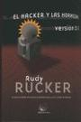

[El Hacker y las hormigas, versión 2.0](http://tienda.cyberdark.net/el-hacker-y-las-hormigas-n11010.html) [Rudy Rucker](http://en.wikipedia.org/wiki/Rudy_Rucker)

He tardado bastante en leerlo. Varios meses. Es que es... joder, es que es un libro muy malo.

Vayamos por partes: el tagline bajo el título es "La imprescindible alternativa al Criptonomicón y al Yo, Robot de Asimov". Esto es un insulto para ambas obras, y debería estar prohibido por ser claramente publicidad engañosa. El libro es lento y bastante aburrido. Lo de tener un personaje que no se entera de nada y al que le pasan cosas le sale bien a [Douglas Coupland](http://en.wikipedia.org/wiki/Douglas_Coupland), pero a Rudy Rucker no. El final es absurdo tirando a ridículo. La verdad es que me lo he terminado por no dejarlo a medias.

Lo compré por dos razones. La primera: era de una nueva colección de libros de ciencia-ficción que ha comenzado hace poco, y quería echarle un vistazo. La edición es bastante buena para ser una editorial pequeña, y no son libros feos, aunque las ilustraciones de portada me parecen muy mejorables. Ya les he comprado [Starplex](http://tienda.cyberdark.net/starplex-n11012.html), aunque éste es de [Robert J. Sawyer](http://en.wikipedia.org/wiki/Robert_J._Sawyer) y eso ya me da algunas garantías mínimas acerca del libro (y fue finalista de los [premios Locus](http://tienda.cyberdark.net/premios-locus.php) y [Nebula](http://tienda.cyberdark.net/premios-nebula.php)).

La segunda: el traductor era [Pedro Jorge Romero](http://www.pjorge.com/), blogger al que leo habitualmente, y él recomendaba el libro. Queda un poco feo decir esto de alguien a quien sueles leer, pero creo que su traducción no ha beneficiado precisamente al libro. Por ejemplo, utiliza expresiones que son traducción directa del inglés que jamás se han usado en castellano ("Oh, bien", "en los viejos días"... Dios, jamás he oído a nadie hablar así en el mundo real). Tampoco es algo que se note demasiado, pero si ya le sumas que el libro que estás leyendo no consigue precisamente atraparte pues son detalles que te sacan completamente de la lectura.

Mal libro. Argh. 